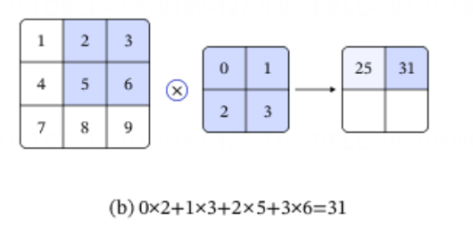
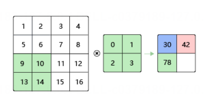
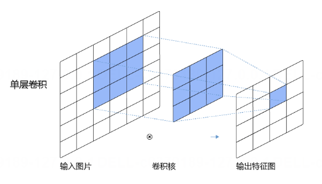
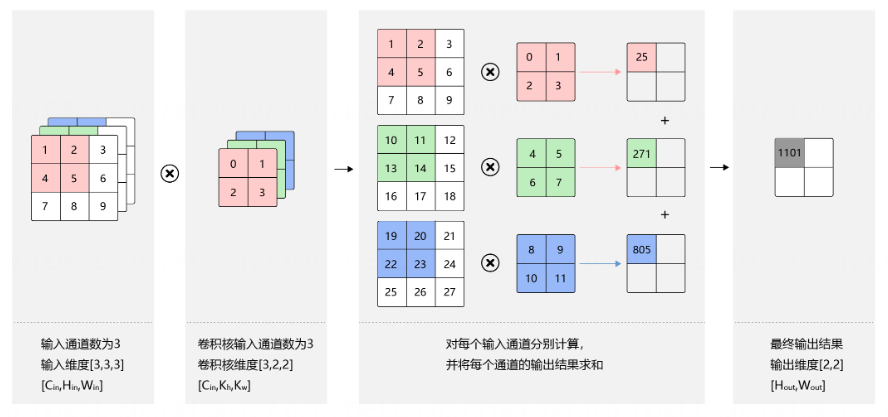
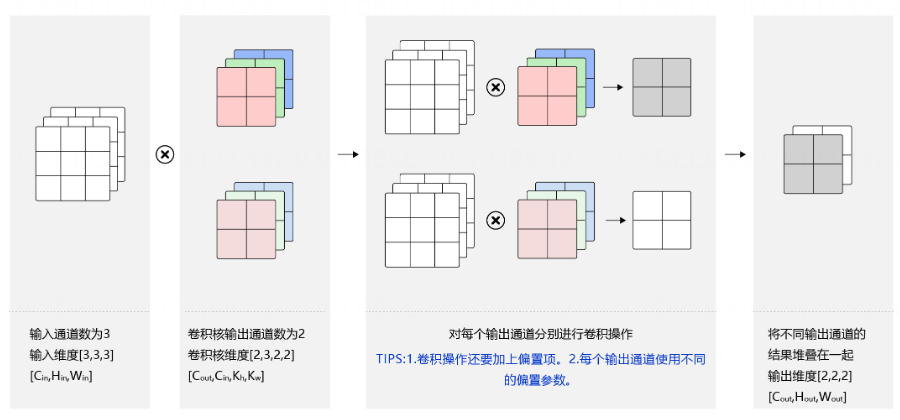
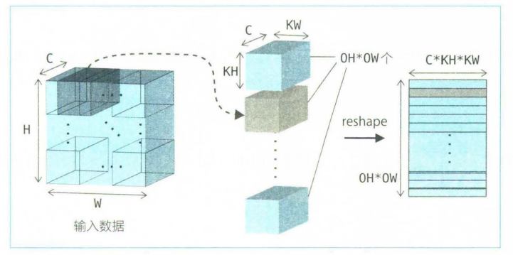
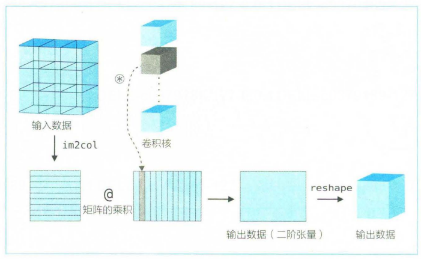
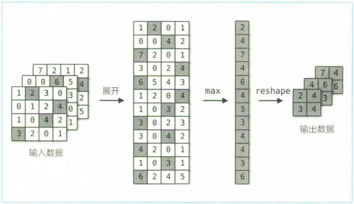

# 《用纯Python手搓经典计算机视觉算法》开源教材 · 小作业4 —— CNN卷积神经网络

> **版本号：v0.1**
>
> 前言：本篇章是山东大学（威海）2023级数科班nailorch小组大作业第三阶段展示内容，小组成员：魏子钦，刘艺航，刘宇，李暄，钦浩然。本章带您从零搭建CNN网络架构，小白也能轻松上手。

# 一、理论基础
## 1. CNN基础组网模块
卷积神经网络(Convolutional neural network, CNN)是受生物学上感受野机制的启发而提出的，是目前计算机视觉中使用最普遍的模型结构。本章节我们将先介绍卷积神经网络一些常用的基础模块，包括：

- 卷积（Convolution）
- 池化（Pooling）
- 激活函数
- 批归一化（Batch Normalization）
- 丢弃法（Dropout）

（其中激活函数、批归一化、Dropout上一节讲过了，这里不再赘述了。）

回顾一下，在上一章，当你要教电脑看图像时，我们可以把整张图片摊成一长条向量再丢进全连接网络中——虽然可行，但会存在如下两个问题：

1.模型参数过多，容易发生过拟合。 在全连接前馈网络中，隐藏层的每个神经元都要跟该层所有输入的神经元相连接。随着隐藏层神经元数量的增多，参数的规模也会急剧增加，导致整个神经网络的训练效率非常低，也很容易发生过拟合。

2.难以提取图像中的局部不变性特征。 自然图像中的物体都具有局部不变性特征，比如尺度缩放、平移、旋转等操作不影响其语义信息。而全连接前馈网络很难提取这些局部不变性特征。

为了解决上述问题，我们引入卷积神经网络进行特征提取，既能提取到相邻像素点之间的特征模式，又能保证参数的个数不随图片尺寸变化。图1 是一个典型的卷积神经网络结构，包含：卷积层、池化层、全连接层、Dropout层，后续详细介绍各层作用。


> 说明：
> 
> 在卷积神经网络中，计算范围是在像素点的空间邻域内进行的，卷积核参数的数目也远小于全连接层。卷积核本身与输入图片大小无关，它代表了对空间邻域内某种特征模式的提取。比如，有些卷积核提取物体边缘特征，有些卷积核提取物体拐角处的特征，图像上不同区域共享同一个卷积核。当输入图片大小不一样时，仍然可以使用同一个卷积核进行操作。

## 2. 卷积

卷积（Convolution）是图像处理中非常重要的计算方式，它能让我们用一个小窗口（卷积核）在图片上“扫描”，并根据窗口覆盖区域的像素计算出新的特征，从而实现边缘检测、模糊、锐化等效果，也是卷积神经网络中最核心的运算单元。

### 2.1 什么是卷积？

如果把一张图片看作是一个像素组成的大网格，那么卷积操作就是：

“拿一个比图片小的矩阵 —— 卷积核（kernel），
把它放到图片的一块区域上，
对应元素相乘再加起来，
得到一个新的数，
然后把卷积核向右或向下移动，继续重复计算。”

这个过程就像把一个小窗户贴在图片的不同位置，通过观察窗口里的像素组合，计算出新的特征值。

需要注意：

在深度学习里，大家通常说的“卷积”实际上是数学上的“互相关”运算，但业内默认就叫卷积，所以统一使用这个术语。

### 2.2 卷积计算举例（2×2卷积核）

假设：

输入图片是一个 3×3 的网格

卷积核是一个 2×2 的网格

我们把卷积核放到输入图片的左上角，四个数字一一相乘再相加，例如：




位置①（左上角）：

(0×1) + (1×2) + (2×4) + (3×5) = 25

然后把卷积核往右移动一格：

位置②（上排中间）：

(0×2) + (1×3) + (2×5) + (3×6) = 31

再往下移动，重复同样操作，就能算出第 3 个和第 4 个结果：

位置③：

(0×4) + (1×5) + (2×7) + (3×8) = 43

位置④：

(0×5) + (1×6) + (2×8) + (3×9) = 49

把这些计算出的结果按照卷积核移动的位置排列起来，就构成了输出特征图。

### 2.3 卷积公式理解

假设：

输入图像为 a

输出结果为 b

卷积核为 w

如果卷积核大小是 kh×kw，则计算过程可总结为：

$$ b[i,j] = ∑(u,v) a[i+u, j+v] × w[u,v] $$

也就是说：

卷积核上的每个格子都乘以输入图片对应位置的像素值，然后全部加起来，作为输出 b[i,j] 的值。

### 2.4 Bias

在卷积神经网络里，卷积通常还会加一个偏置项 b，例如加 1，那么前面 25 就会变成：

25 + 1 = 26

这样做的目的：

给网络增加可学习的自由度

提高模型对复杂模式的拟合能力

### 2.5 卷积综述
卷积就是：

“拿一个小矩阵到大矩阵上滑动，
每到一个位置，
点乘（对应乘法再求和），
得到一个新的像素值。”

它像是：

一个特征扫描仪

一个图像滤波器

一个能够学习“怎么看世界”的窗口

卷积神经网络就是由很多这样的窗口叠加组成，通过多层学习逐渐学会识别图像中的结构，例如边缘、角点、纹理甚至语义特征。

## 3. Padding（填充）

### 3.1 简述
 
Padding（填充）

在实际卷积计算中，我们会遇到一个非常常见的问题：

“卷积核越大，输出图片就越小。”

为什么？

因为卷积核只能放在输入图像可以完整覆盖的位置，
核每向右或向下滑一次，输出就少一圈。

例如：

输入：3×3

卷积核：2×2

卷积完后输出只剩：2×2
变小了！

但是很多时候，我们不希望输出变小，比如：

想保持图像大小不变，抑或是想让深层网络的特征分辨率一致
，想让边界像素也被“公平”使用

于是 —— 填充（Padding）就登场了。

当卷积核尺寸大于1时，输出特征图的尺寸会小于输入图片尺寸。如果经过多次卷积，输出图片尺寸会不断减小，边界和角落像素丢失越来越多，导致模型训练效果不佳。且当卷积核的高度和宽度不同，通过填充(padding)使输入和输出具有相同的宽和高。

### 3.2 一般填充Padding公式

如果在高度方向：

- 上侧填充 ph1 行  
- 下侧填充 ph2 行

在宽度方向：

- 左侧填充 pw1 列  
- 右侧填充 pw2 列

则填充后的输入图像尺寸为：

$$
(H + ph1 + ph2) \times (W + pw1 + pw2)
$$

当卷积核大小为：

$$
kh \times kw
$$

卷积操作后的输出尺寸为：

$$
H_{out} = H + ph1 + ph2 - kh + 1
$$

$$
W_{out} = W + pw1 + pw2 - kw + 1
$$

这些公式体现了卷积核在图像上逐步滑动，每产生一次位置计算就得到一个输出像素，是卷积输出尺寸最基本的推导方式（未考虑步幅）。

---

**常用对称填充方式**

在深度学习中，通常会使用左右或上下对称填充，例如：

$$
ph1 = ph2 = ph ,\quad pw1 = pw2 = pw
$$

此时输出尺寸变为：

$$
H_{out} = H + 2ph - kh + 1
$$

$$
W_{out} = W + 2pw - kw + 1
$$

对称填充在 VGG、ResNet 等现代 CNN 中非常常见，因为它确保图像中心与边缘的卷积操作具有一致性，不会产生偏置。

---

**保持卷积前后尺寸一致**

卷积核大小通常为奇数，如 1、3、5、7。  
如果计算填充大小：

$$
ph = (kh - 1)/2 ,\quad pw = (kw - 1)/2
$$

则卷积后：

$$
H_{out} = H ,\quad W_{out} = W
$$

也就是说，输出尺寸与输入完全相同。

举例：

- 卷积核大小 3×3：

  $$
  ph = pw = (3-1)/2 = 1
  $$

  输出尺寸不变。

- 卷积核大小 5×5：

  $$
  ph = pw = (5-1)/2 = 2
  $$

  输出尺寸同样保持一致。

这种设置在深度学习中称为 **same padding（保持尺寸不变）**，大量用于保证网络堆叠多层后特征图尺寸仍然稳定，从而减少结构设计难度。

## 4.stride（步幅）

前面我们说过：

卷积核是一个小窗口，会在输入图片上不断“滑动”，每到一个位置，就做一次“乘加”计算，得到一个输出值。

那么一个问题来了：

“卷积核每次滑动的时候，是滑几格？”

这就由 —— 步幅（stride） 决定。

简单理解：

stride = 1：每次移动 1 个像素，挪一格算一次

stride = 2：每次跳 2 个像素，不挤满计算

stride 越大，输出越小

它就像：

"你走路是迈小碎步一步一步挪，还是大步流星隔两格走？"

eg.




**stride 在神经网络中的作用：**

✔ 控制特征图缩放
✔ 控制计算量开销
✔ 起到“降采样”的效果

在 CNN 中：

小步幅配合 SAME 经常让网络保持同样的尺寸

大步幅配合 VALID 可以快速降低图像分辨率，类似池化（pooling）

很多 Backbone 中（如 ResNet）：

第一层卷积常常 stride=2，让图像先缩一次

后面再继续卷积提取更高级特征

## 5. 感受野（Receptive Field）

在卷积神经网络中，我们常会问一个问题：

“网络深处的某个神经元，到底受输入图片的哪一块区域影响？”

它不可能只知道自己所在位置的那一个像素，而应该综合了卷积窗口覆盖的范围。这个范围，就叫 —— 感受野（Receptive Field）。

一句话：

感受野 = 一个神经元在原始输入平面上能“看到”的区域大小

假设我们做一次普通卷积：

输入：图像

卷积核：3×3，stride=1，不加 padding

那么：

输出图中每一个像素，都由输入图中 3×3 的区域计算得到，所以该像素的感受野 = 3×3

意思是：

“这个输出像素只观察到了输入图中的 3×3 区域”。

还有一个更直观的图像来辅助理解：




> 不难知道，深层 CNN 必须有足够大的感受野才能“理解全局”。

## 6. 多输入通道、多输出通道与批量卷积计算详解

在前面的例子中，我们只介绍了最基础的二维卷积计算方式，输入与输出都只有单通道。但在真实的深度学习应用中，图像、视频以及各类信号往往拥有多个通道，并且通常需要一次处理多个数据样本（mini-batch）。因此，卷积计算需要能够处理：

- 多输入通道（Multi-Input Channels）
- 多输出通道（Multi-Output Channels）
- 批量计算（Batch Processing）

下面依次介绍这三种情况的结构与计算方式。

---

### 6.1 多输入通道卷积计算

对单通道输入的卷积，卷积核是一个二维矩阵。而在彩色图像中，图像通常具有 RGB 三个通道，因此输入会变成三维数据。假设输入图像的通道数为：

$$C_{in}$$

则输入数据的维度为：

$$
C_{in} \times H_{in} \times W_{in}
$$

此时卷积核也不再是二维矩阵，而是为每个输入通道分别设计一个卷积核，卷积核的形状为：

$$
C_{in} \times k_h \times k_w
$$

计算方式如下：

1. 对于任意输入通道：

   $$
   c_{in} \in [0, C_{in})
   $$

   使用大小为：

   $$
   k_h \times k_w
   $$

   的卷积核与对应的输入通道：

   $$
   H_{in} \times W_{in}
   $$

   进行单通道卷积计算。

2. 将所有输入通道卷积结果累加得到最终输出，其尺寸为：

$$
H_{out} \times W_{out}
$$

总结：多输入通道卷积本质上是对每个输入通道独立做卷积再求和。




---

### 6.2 多输出通道卷积计算

实际使用中，卷积层的输出通常也具备多个通道，例如 32 个、64 个或更多。若设输出通道数为：

$$
C_{out}
$$

则卷积核的形状进一步扩展为：

$$
C_{out} \times C_{in} \times k_h \times k_w
$$

也就是说，每一个输出通道都需要一个完整的：

$$
C_{in} \times k_h \times k_w
$$

的卷积核。

卷积方式如下：

1. 对于每个输出通道：

   $$
   c_{out} \in [0, C_{out})
   $$

   使用对应的卷积核与输入数据执行上节描述的多输入通道卷积。

2. 每个输出通道都会得到一个：

   $$
   H_{out} \times W_{out}
   $$

   的二维特征图。

3. 将所有输出通道沿通道维度拼接，形成最终输出特征图，其形状为：

$$
C_{out} \times H_{out} \times W_{out}
$$

> 注意：通常我们将卷积核的输出通道数称为该卷积层的“卷积核个数”。



---

### 6.3 批量卷积（mini-batch）

在训练卷积神经网络时，通常不会逐张处理图片，而是将多个样本组合成一个 mini-batch，同时输入网络。设批量大小为：

$$
N
$$

则输入数据的形状为：

$$
N \times C_{in} \times H_{in} \times W_{in}
$$

卷积核形状与多输出通道情况一致：

$$
C_{out} \times C_{in} \times k_h \times k_w
$$

输出特征图也将扩展为四维结构：

$$
N \times C_{out} \times H_{out} \times W_{out}
$$

其中：

- 对 batch 中每一个样本，分别执行相同的卷积计算
- 所有样本共享同一组卷积核参数

因此，批量卷积能够在同一时间利用 GPU 对多个样本并行处理，提高计算效率。

---

### 6.4 总结对比

| 场景 | 输入维度 | 卷积核维度 | 输出维度 |
|---|---|---|---|
| 单通道 | $$H_{in} \times W_{in}$$ | $$k_h \times k_w$$ | $$H_{out} \times W_{out}$$ |
| 多输入通道 | $$C_{in} \times H_{in} \times W_{in}$$ | $$C_{in} \times k_h \times k_w$$ | $$H_{out} \times W_{out}$$ |
| 多输出通道 | $$C_{in} \times H_{in} \times W_{in}$$ | $$C_{out} \times C_{in} \times k_h \times k_w$$ | $$C_{out} \times H_{out} \times W_{out}$$ |
| 批量计算 | $$N \times C_{in} \times H_{in} \times W_{in}$$ | $$C_{out} \times C_{in} \times k_h \times k_w$$ | $$N \times C_{out} \times H_{out} \times W_{out}$$ |


## 7. 池化（Pooling）

在卷积神经网络里，每一层卷积都会生成新的特征图。如果所有特征图都保持原有大小，随着网络加深，数据量会迅速膨胀，计算会变得越来越慢，同时模型也容易发生过拟合。为了解决这些问题，网络引入了池化操作（Pooling），它通过“压缩空间尺寸但保留重要信息”来减少数据规模、增强特征稳定性。

池化的核心思想非常简单：用一个小窗口在特征图上滑动，每次从窗口覆盖的区域中提取一个代表值，用它来代替这一小块区域，从而形成尺寸更小的新特征图。池化不会增加新的参数，却能显著减少计算量，提高模型泛化能力。

常见的池化方式主要有两种：

第一种是最大池化（Max Pooling）。它在窗口中挑出最大的数作为代表，也就是说它只记录局部最明显、最强的响应。这在图像特征中常常意味着边缘、纹理或物体的重要细节，因此现代 CNN 大多采用最大池化。例如，下列 2×2 区域：

1  5

3  4

最大池化选取的结果是 5，因为它是区域中的最大值。

第二种是平均池化（Average Pooling），它将窗口内所有数取平均，更像是一种平滑操作，不会因为某一个尖锐的值而做出极端判断。例如，同样的 2×2 区域：

(1 + 5 + 3 + 4) / 4 = 3.25

这种方式比较均衡，在一些特殊任务（如密度估计）中仍然常用，但在现代 CNN 中使用频率相对较低。

池化操作还需要设定窗口大小和步幅（stride）。例如，如果使用 2×2 的池化窗口并设定 stride=2，那么池化窗口每次覆盖 2×2 的区域，并向右或向下移动 2 个单位，再处理下一个区域。下面给出一个完整的例子：

输入是一个 4×4 的特征图：

1  2  3  4

5  6  7  8

9  1  2  3

4  5  6  7

使用 2×2 最大池化、步幅为 2，可以分成四个小窗口：

窗口 1：

1  2

5  6

最大值为 6

窗口 2：

3  4

7  8

最大值为 8

窗口 3：

9  1

4  5

最大值为 9

窗口 4：

2  3

6  7

最大值为 7

最终输出是一个 2×2 的结果：

6  8

9  7

可以看到，经过池化后特征图的大小从 4×4 缩小成了 2×2，数据量减少了一半，但最显著的特征信息仍然保留了下来。这正是池化的价值所在：简单、无参数、降低计算量、提升特征表达的鲁棒性。

## 7. 池化（Pooling）

在卷积神经网络里，每一层卷积都会生成新的特征图。如果所有特征图都保持原有大小，随着网络加深，数据量会迅速膨胀，计算会变得越来越慢，同时模型也容易发生过拟合。为了解决这些问题，网络引入了池化操作（Pooling），它通过“压缩空间尺寸但保留重要信息”来减少数据规模、增强特征稳定性。

池化的核心思想非常简单：用一个小窗口在特征图上滑动，每次从窗口覆盖的区域中提取一个代表值，用它来代替这一小块区域，从而形成尺寸更小的新特征图。池化不会增加新的参数，却能显著减少计算量，提高模型泛化能力。

常见的池化方式主要有两种：

第一种是最大池化（Max Pooling）。它在窗口中挑出最大的数作为代表，也就是说它只记录局部最明显、最强的响应。这在图像特征中常常意味着边缘、纹理或物体的重要细节，因此现代 CNN 大多采用最大池化。例如，下列 2×2 区域：

1  5

3  4

最大池化选取的结果是 5，因为它是区域中的最大值。

第二种是平均池化（Average Pooling），它将窗口内所有数取平均，更像是一种平滑操作，不会因为某一个尖锐的值而做出极端判断。例如，同样的 2×2 区域：

(1 + 5 + 3 + 4) / 4 = 3.25

这种方式比较均衡，在一些特殊任务（如密度估计）中仍然常用，但在现代 CNN 中使用频率相对较低。

池化操作还需要设定窗口大小和步幅（stride）。例如，如果使用 2×2 的池化窗口并设定 stride=2，那么池化窗口每次覆盖 2×2 的区域，并向右或向下移动 2 个单位，再处理下一个区域。下面给出一个完整的例子：

输入是一个 4×4 的特征图：

1  2  3  4

5  6  7  8

9  1  2  3

4  5  6  7

使用 2×2 最大池化、步幅为 2，可以分成四个小窗口：

窗口 1：

1  2

5  6

最大值为 6

窗口 2：

3  4

7  8

最大值为 8

窗口 3：

9  1

4  5

最大值为 9

窗口 4：

2  3

6  7

最大值为 7

最终输出是一个 2×2 的结果：

6  8

9  7

可以看到，经过池化后特征图的大小从 4×4 缩小成了 2×2，数据量减少了一半，但最显著的特征信息仍然保留了下来。这正是池化的价值所在：简单、无参数、降低计算量、提升特征表达的鲁棒性。

# 二、手撕实现细节

我们基于先前写的nailorch框架，我们完善几个函数即可。

框架讲解：[https://scnd2n1l49md.feishu.cn/wiki/J4hIwOIOKi7Q4rk6J9Jc2jRanEg?from=from_copylink](https://scnd2n1l49md.feishu.cn/wiki/J4hIwOIOKi7Q4rk6J9Jc2jRanEg?from=from_copylink)

不懂的自行去补充一下知识点，内容较长，这里不放了，主要为一些偏工程实现方面的内容。

## 1.开胃菜-get_conv_outsize函数

首先，回顾一下卷积、填充、偏置、步幅等术语以及操作。我们对于一个输入的图像是怎么操作的？

肯定先是填充，然后根据步幅进行卷积，然后再是加上偏置。最后输出一个新的图片。但是前后的图片维度可能会发生变化，我们可以这样计算：

```python
def get_conv_outsize(input_size, kernel_size, stride, pad):
    return (input_size - kernel_size + 2 * pad) // stride + 1
```
这个函数是分水平和竖直方向需要分开调用的。这很简单，我们接下来也会用到。

## 2. im2col函数

im2col 是一个用于展开输入数据的函数，它将输入数据展开为卷积核易于处理的形式。如下图所示，它从作为输入数据的三阶张量中取出了应用卷积核的区域（准确来说是从包括批量大小在内的四阶张量中取出应用卷积核的区域），并把它扁平化。




为啥要这么做呢？学过程序设计的都知道，这样做必然会增加空间复杂度！而且对时间上的优化几乎没有，似乎在事倍功半。而实际上，这样可以把二维层面的东西拉成一维，当我们把卷积核也进行维度变换后，我们实际上的工作就只剩下了矩阵乘法。而现代计算机对矩阵乘法的优化是相当极致的，时间上远低于一堆循环。配合GPU，能够能实现极高并行效率。




接下来我们讲一下这个函数的实现细节：
```python
class Im2col(Function):
    def __init__(self, kernel_size, stride, pad, to_matrix):
        super().__init__()
        self.input_shape = None
        self.kernel_size = kernel_size
        self.stride = stride
        self.pad = pad
        self.to_matrix = to_matrix

    def forward(self, x):
        self.input_shape = x.shape
        y = im2col_array(x, self.kernel_size, self.stride, self.pad,
                         self.to_matrix)
        return y

    def backward(self, gy):
        gx = col2im(gy, self.input_shape, self.kernel_size, self.stride,
                    self.pad, self.to_matrix)
        return gx


def im2col(x, kernel_size, stride=1, pad=0, to_matrix=True):
    y = Im2col(kernel_size, stride, pad, to_matrix)(x)
    return y


class Col2im(Function):
    def __init__(self, input_shape, kernel_size, stride, pad, to_matrix):
        super().__init__()
        self.input_shape = input_shape
        self.kernel_size = kernel_size
        self.stride = stride
        self.pad = pad
        self.to_matrix = to_matrix

    def forward(self, x):
        y = col2im_array(x, self.input_shape, self.kernel_size, self.stride,
                         self.pad, self.to_matrix)
        return y

    def backward(self, gy):
        gx = im2col(gy, self.kernel_size, self.stride, self.pad,
                    self.to_matrix)
        return gx


def col2im(x, input_shape, kernel_size, stride=1, pad=0, to_matrix=True):
    return Col2im(input_shape, kernel_size, stride, pad, to_matrix)(x)

def im2col_array(img, kernel_size, stride, pad, to_matrix=True):

    N, C, H, W = img.shape
    KH, KW = pair(kernel_size)
    SH, SW = pair(stride)
    PH, PW = pair(pad)
    OH = get_conv_outsize(H, KH, SH, PH)
    OW = get_conv_outsize(W, KW, SW, PW)

    img = np.pad(img,
                    ((0, 0), (0, 0), (PH, PH + SH - 1), (PW, PW + SW - 1)),
                    mode='constant', constant_values=(0,))
    col = np.ndarray((N, C, KH, KW, OH, OW), dtype=img.dtype)

    for j in range(KH):
        j_lim = j + SH * OH
        for i in range(KW):
            i_lim = i + SW * OW
            col[:, :, j, i, :, :] = img[:, :, j:j_lim:SH, i:i_lim:SW]

    if to_matrix:
        col = col.transpose((0, 4, 5, 1, 2, 3)).reshape((N * OH * OW, -1))

    return col


def col2im_array(col, img_shape, kernel_size, stride, pad, to_matrix=True):
    N, C, H, W = img_shape
    KH, KW = pair(kernel_size)
    SH, SW = pair(stride)
    PH, PW = pair(pad)
    OH = get_conv_outsize(H, KH, SH, PH)
    OW = get_conv_outsize(W, KW, SW, PW)

    if to_matrix:
        col = col.reshape(N, OH, OW, C, KH, KW).transpose(0, 3, 4, 5, 1, 2)

    img = np.zeros((N, C, H + 2 * PH + SH - 1, W + 2 * PW + SW - 1),
                    dtype=col.dtype)
    for j in range(KH):
        j_lim = j + SH * OH
        for i in range(KW):
            i_lim = i + SW * OW
            img[:, :, j:j_lim:SH, i:i_lim:SW] += col[:, :, j, i, :, :]
    return img[:, :, PH:H + PH, PW:W + PW]
```
对于卷积：

    输入 → im2col → 矩阵乘法（卷积核 × 展开矩阵）→ 输出
反向传播：

    输出梯度 → col2im → 把梯度累回输入对应位置
    
知道了这两个东西后，`class Col2im(Function)`还有`class Im2col(Function)`就不需要仔细看了，我们来重点关注`im2col_array`函数的实现过程：

首先`img = np.pad(...)`对输入图像进行padding，然后`col = np.ndarray((N, C, KH, KW, OH, OW))`生成展开后的 6 维数组（N  批大小、C  通道数、KH 卷积核高、KW 卷积核宽、OH 输出高、OW 输出宽）然后再把这个六位数组变成"矩阵":
```python
for j in range(KH):
    j_lim = j + SH * OH
    for i in range(KW):
        i_lim = i + SW * OW
        col[:, :, j, i, :, :] = img[:, :, j:j_lim:SH, i:i_lim:SW]
```
外层 j,i 针对卷积核的 (row, col)。切片语句相当于：在输入上跳步扫描，把卷积核看到的每个位置都取下来，最后`to_matrix`，形状变成`(N * OH * OW, C * KH * KW)`也就是 “每一行是一个滑窗展开区域”，正好可以进行对应的矩阵乘法。

反向：col2im_array

它就是反过程：

把每个展开窗口对应的梯度，累加回输入对应位置。

因为展开时一个输入像素可能被多个卷积窗口复用，所以反向要累加，这部分不赘述了。
## 3. conv2d函数
```python
def conv2d_simple(x, W, b=None, stride=1, pad=0):
    x, W = as_variable(x), as_variable(W)

    Weight = W
    N, C, H, W = x.shape
    OC, C, KH, KW = Weight.shape
    SH, SW = pair(stride)
    PH, PW = pair(pad)
    OH = get_conv_outsize(H, KH, SH, PH)
    OW = get_conv_outsize(W, KW, SW, PW)

    col = im2col(x, (KH, KW), stride, pad, to_matrix=True)
    Weight = Weight.reshape(OC, -1).transpose()
    t = linear(col, Weight, b)
    y = t.reshape(N, OH, OW, OC).transpose(0, 3, 1, 2)
    return y
```
首先，转成框架的 Variable 格式，然后解析输入形状，获得参数，接下来计算一下最终output的大小，并输出大小计算。然后调用im2col —— 将输入变为矩阵，再把卷积核展开为矩阵`Weight = Weight.reshape(OC, -1).transpose()`，原卷积核：`(OC, C, KH, KW)`，展开为：`(C * KH * KW, OC)`。然后用矩阵乘法代替卷积，最后 reshape 回输出特征图格式。这是现代卷积实现的核心套路。

## 4. Pooling函数

与conv2d_simple函数一样，这个函数也使用im2col展开输入数据。不同的是与卷积层不同的是，在池化时各通道方向是独立的。也就是说，池化的应用区域按通道单独展开。流程如下图所示：




```python
def pooling_simple(x, kernel_size, stride=1, pad=0):
    x = as_variable(x)

    N, C, H, W = x.shape
    KH, KW = pair(kernel_size)
    PH, PW = pair(pad)
    SH, SW = pair(stride)
    OH = get_conv_outsize(H, KH, SH, PH)
    OW = get_conv_outsize(W, KW, SW, PW)

    col = im2col(x, kernel_size, stride, pad, to_matrix=True)
    col = col.reshape(-1, KH * KW)
    y = col.max(axis=1)
    y = y.reshape(N, OH, OW, C).transpose(0, 3, 1, 2)
    return y
```
`pooling_simple` 使用 `im2col` 来加速池化计算。它先将输入张量按照池化窗口展开成二维矩阵，每一行表示一个池化区域中的所有元素。与卷积不同，池化对每个通道独立进行，不进行跨通道数值混合，因此 `C` 个通道分别独立展开。展开后，对每一行执行 `max` 运算即可得到该窗口的池化结果。最终，将计算结果重新 reshape 回 `(N, C, OH, OW)` 的标准输出维度，从而完成最大池化的 forward 过程。

至此，我们就完成了CNN核心的函数。

## 5. 模型搭建

我们来搭建一个VGG16模型，这是流程图：

对应到实现上：
```python
class VGG16(Model):
    def __init__(self):
        super().__init__()
        self.conv1_1 = L.Conv2d(64, kernel_size=3, stride=1, pad=1)
        self.conv1_2 = L.Conv2d(64, kernel_size=3, stride=1, pad=1)
        self.conv2_1 = L.Conv2d(128, kernel_size=3, stride=1, pad=1)
        self.conv2_2 = L.Conv2d(128, kernel_size=3, stride=1, pad=1)
        self.conv3_1 = L.Conv2d(256, kernel_size=3, stride=1, pad=1)
        self.conv3_2 = L.Conv2d(256, kernel_size=3, stride=1, pad=1)
        self.conv3_3 = L.Conv2d(256, kernel_size=3, stride=1, pad=1)
        self.conv4_1 = L.Conv2d(512, kernel_size=3, stride=1, pad=1)
        self.conv4_2 = L.Conv2d(512, kernel_size=3, stride=1, pad=1)
        self.conv4_3 = L.Conv2d(512, kernel_size=3, stride=1, pad=1)
        self.conv5_1 = L.Conv2d(512, kernel_size=3, stride=1, pad=1)
        self.conv5_2 = L.Conv2d(512, kernel_size=3, stride=1, pad=1)
        self.conv5_3 = L.Conv2d(512, kernel_size=3, stride=1, pad=1)
        self.fc6 = L.Linear(4096)
        self.fc7 = L.Linear(4096)
        self.fc8 = L.Linear(1000)

    def forward(self, x):
        x = F.relu(self.conv1_1(x))
        x = F.relu(self.conv1_2(x))
        x = F.pooling(x, 2, 2)
        x = F.relu(self.conv2_1(x))
        x = F.relu(self.conv2_2(x))
        x = F.pooling(x, 2, 2)
        x = F.relu(self.conv3_1(x))
        x = F.relu(self.conv3_2(x))
        x = F.relu(self.conv3_3(x))
        x = F.pooling(x, 2, 2)
        x = F.relu(self.conv4_1(x))
        x = F.relu(self.conv4_2(x))
        x = F.relu(self.conv4_3(x))
        x = F.pooling(x, 2, 2)
        x = F.relu(self.conv5_1(x))
        x = F.relu(self.conv5_2(x))
        x = F.relu(self.conv5_3(x))
        x = F.pooling(x, 2, 2)
        x = F.reshape(x, (x.shape[0], -1))
        x = F.dropout(F.relu(self.fc6(x)))
        x = F.dropout(F.relu(self.fc7(x)))
        x = self.fc8(x)
        return x

    @staticmethod
    def preprocess(image, size=(224, 224), dtype=np.float32):
        image = image.convert('RGB')
        if size:
            image = image.resize(size)
        image = np.asarray(image, dtype=dtype)
        image = image[:, :, ::-1]
        image -= np.array([103.939, 116.779, 123.68], dtype=dtype)
        image = image.transpose((2, 0, 1))
        return image
```