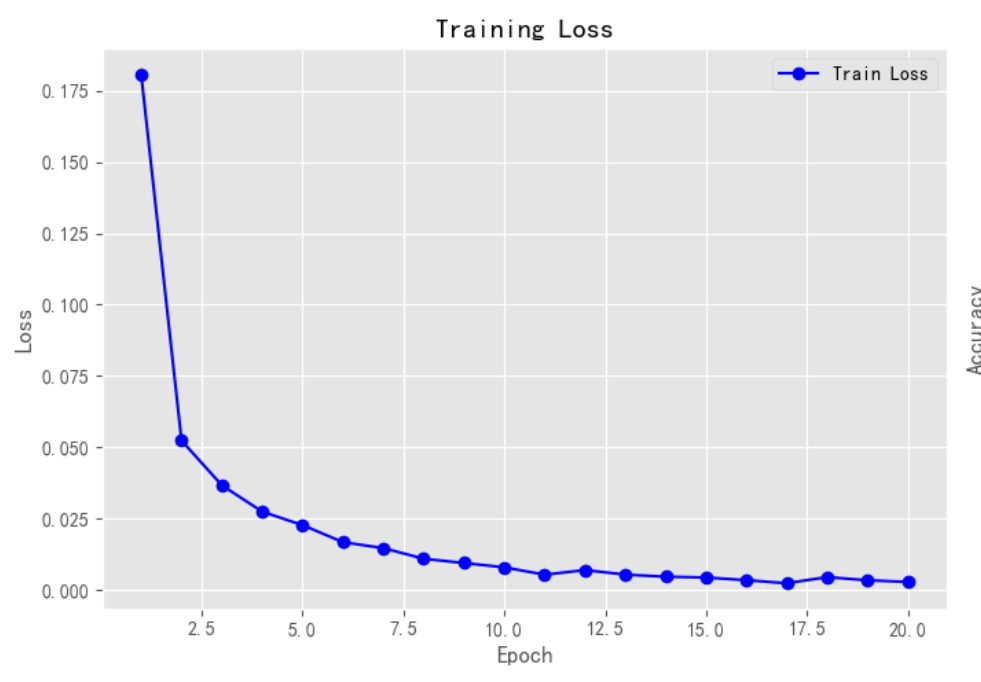
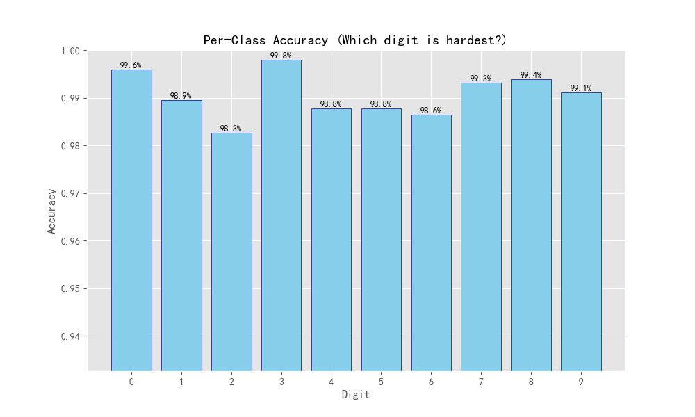
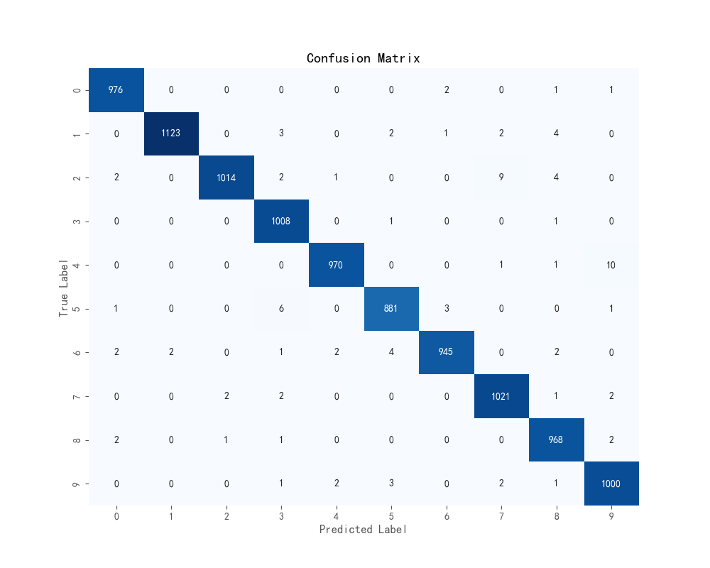
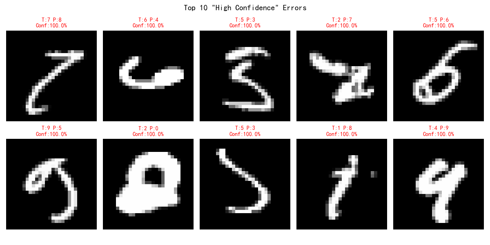
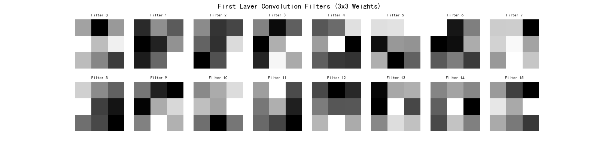
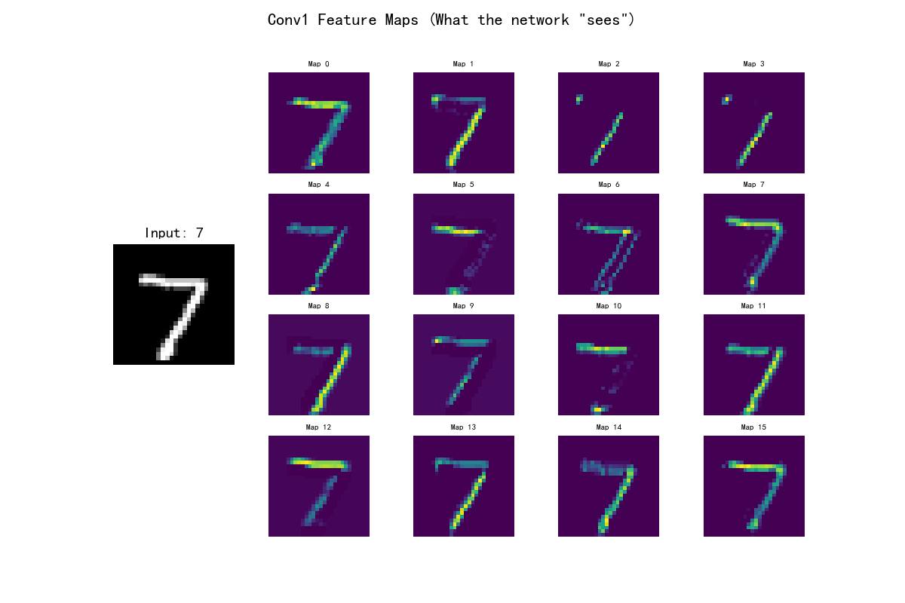

最终测试集准确率 (Overall Accuracy): 99.06%

### 1. 训练趋势

    * 曲线非常平滑，Loss 在前 2 个 Epoch 急剧下降，随后平稳收敛。这表明学习率 $lr=0.001$ 设置得当，梯度下降过程很顺利。

### 2. 类别识别难易度分析 

这张图表明模型并不是对所有数字都一视同仁：
* **最强项**：数字 **3** (99.8%) 和 **0** (99.6%)。
    * *分析*：'0' 是封闭圆圈，'3' 也是特征非常鲜明的弯曲结构，模型几乎不会认错。
* **最弱项**：数字 **2** (98.3%) 和 **6** (98.6%)。
    * *分析*：虽然 98.3% 依然很高，但相比 '3' 的 99.8% 确实是短板。数字 '2' 书写变体极多（有的像 'Z'，有的底部有圈），容易和 '7' 或 '8' 混淆。

### 3. 混淆矩阵深度解读 

混淆矩阵揭示了模型“眼花”的时候到底把谁看成了谁：
* **主对角线**：数值极大（如 1123, 1014 等），代表绝大多数样本预测正确。
* **主要错题集**：
    * **4 和 9 的纠葛**：
        * 真值是 **4**，被误认为 **9** 的有 **10** 个样本。
        * *原因*：手写时如果 '4' 的顶部封口了，看起来就极像 '9'。这是 MNIST 中最经典的混淆对。
    * **2 的困境**：
        * 真值是 **2**，被误认为 **7** 的有 **9** 个。
        * 真值是 **2**，被误认为 **8** 的有 **4** 个。
        * *原因*：'2' 的尾巴如果写直了像 '7'，如果写卷了像 '8'。

### 4. “高置信度”错误分析 

这张图展示了**模型最“固执己见”的错误**（置信度 100% 但错了）。

### 5. 打开黑盒：模型到底看到了什么？
* **卷积核**：

    * 第一层的 $16$ 个 $3 \times 3$ 滤波器已经学到了**边缘检测**。你可以看到有的核是“左黑右白”（检测竖线），有的是“上黑下白”（检测横线），还有对角线特征。这证明卷积层确实在工作。
* **特征图 ：

    * 输入是一个 **7**。
    * 输出的特征图中，有的图只高亮了顶部的横线，有的图只高亮了倾斜的竖线。这直观地展示了神经网络是**“拆解笔画”**来认字的：它先把 '7' 拆成“一横”和“一撇”，全连接层再根据“既有一横又有一撇”判断出这是 '7'。

