# 两层全连接神经网络：从基础原理到训练优化
## 第1节：感知机


### 1.1. 提出的动机
在20世纪50年代，人工智能的先驱们面临一个核心问题：机器能否像人一样“学习”？当时的计算设备主要执行预先设定的、固定的程序。研究者们渴望创建一种能够自动从经验（数据）中学习并改进其性能的模型，特别是用于解决分类问题（例如，区分不同的模式）。

感知机的提出，正是为了回应这一挑战。其核心动机是构建一个最简单的、受生物启发的计算单元，它不需要复杂的预编程逻辑，而是能通过一个简单的“学习算法”来自动调整其内部参数，以正确地对输入进行分类。

### 1.2. 感知机模型的形式化定义

感知机的结构在数学上异常简洁。它包含三个核心部分：

1.  **输入 (Input)**：一个 $$n$$ 维的特征向量 $$X = [x_1, x_2, ..., x_n]$$。
2.  **参数 (Parameters)**：一组与输入维度相对应的权重 $$W = [w_1, w_2, ..., w_n]$$ 和一个标量偏置 $$b$$。权重 $$w_i$$ 衡量了第 $$i$$ 个输入特征 $$x_i$$ 的重要性，而偏置 $$b$$ 则代表了神经元的固有激活阈值。
3.  **线性组合 (Weighted Sum)**：模型首先计算输入的加权总和，在数学上表示为 $$z$$：
    $$z = W \cdot X + b = \sum_{i=1}^n w_i x_i + b$$
4.  **激活函数 (Activation)**：感知机使用一个非线性的**阶跃函数 (Step Function)** 来产生最终的二元输出（例如 $$-1$$ 或 $$+1$$，或 $$0$$ 或 $$1$$）。
    $$\hat{y} = \text{step}(z) = \begin{cases} 1 & \text{if } z > 0 \\ 0 & \text{if } z \le 0 \end{cases}$$

### 1.3. 感知机的几何解释

感知机的核心在于其线性组合 $$z$$。方程 $$z = 0$$（即 $$\sum_{i=1}^n w_i x_i + b = 0$$）在 $$n$$ 维特征空间中定义了一个**超平面（Hyperplane）**。

这个超平面是模型的**决策边界 (Decision Boundary)**。

* 当一个数据点 $$X$$ 位于超平面的“正”侧（$$z > 0$$），感知机输出 1。
* 当它位于“负”侧（$$z \le 0$$），感知机输出 0。

因此，感知机本质上是一个**线性分类器（Linear Classifier）**。它的全部能力就是“画一条直线（或一个平面/超平面），将数据空间一分为二”。

### 1.4. 感知机学习算法

感知机的学习算法同样简单，它遵循“有错则改”的原则。如果感知机对一个样本 $$X$$ 预测错误（例如，真实标签 $$y=1$$ 但预测 $$\hat{y}=0$$），它就会调整其 $$W$$ 和 $$b$$，使决策边界向该样本“移动”，以试图将其正确分类。这个算法被证明是收敛的，但其前提条件是——数据必须是**线性可分的**。

---

## 第2节：线性模型的致命问题：XOR问题

### 2.1. 线性可分性 (Linear Separability)

感知机的收敛性承诺使其在早期备受追捧，但它的成功完全依赖于一个假设：数据是线性可分的。

**线性可分 (Linearly Separable)** 的定义是：如果存在一个超平面（一条直线），能够将两类数据点完美地分在决策边界的两侧，则称该数据集是线性可分的。

例如，逻辑**与门 (AND)** 和**或门 (OR)** 都是线性可分的。

* **AND**: (0,0) -> 0; (0,1) -> 0; (1,0) -> 0; (1,1) -> 1。我们可以画一条线（例如 $$x_1 + x_2 - 1.5 = 0$$），将 (1,1) 点与其他三个点分开。
* **OR**: (0,0) -> 0; (0,1) -> 1; (1,0) -> 1; (1,1) -> 1。我们也可以画一条线（例如 $$x_1 + x_2 - 0.5 = 0$$），将 (0,0) 点与其他三个点分开。

### 2.2. “无法解决”的问题：异或门 (XOR)

然而，研究者们很快发现了一个感知机无法解决的、极其简单的问题：**异或门 (XOR)**。

XOR的真值表如下：

* (0, 0) -> 0
* (0, 1) -> 1
* (1, 0) -> 1
* (1, 1) -> 0

核心论证：
如果我们将这四个点绘制在二维平面上，问题就显而易见了。(0,0) 和 (1,1) 属于类别 0，而 (0,1) 和 (1,0) 属于类别 1。
**你永远无法在二维平面上画出*一条*直线，同时将 (0,0) 和 (1,1) 归为一类，并将 (0,1) 和 (1,0) 归为另一类。**

### 2.3. 感知机的失败

XOR问题暴露了感知机作为线性分类器的理论上限，决定了它在数学上*不可能*解决XOR这样的线性不可分问题。这一发现（以及其他相关批评）给早期的人工智能领域带来了巨大的冲击，相关理论停滞了挺长一段时间。

---

## 第3节：两层全连接神经网络与非线性

### 3.1. 解决方案的诞生

感知机的失败（XOR问题）引发了一个关键思考：

**“单个感知机（一条线）不行，那么是否可以用*多个*感知机（多条线）来组合，以创建更复杂的决策边界？”**

答案是肯定的。在几何上，我们可以通过组合多个线性边界来“框出”XOR的解。例如：

1.  用一条线（NAND门）将 (1,1) 与其他点分开。
2.  用另一条线（OR门）将 (0,0) 与其他点分开。
3.  然后将这两个决策的结果进行组合（AND门），就能得到XOR的解。

### 3.2. 两层全连接神经网络架构：隐藏层 (Hidden Layer) 的引入


这个“组合”的思想，在架构上的体现就是**隐藏层 (Hidden Layer)** 的引入，这标志着**多层感知机 (Multi-Layer Perceptron, MLP)**——即我们所说的“神经网络”——的诞生。

一个解决XOR问题的“两层神经网络”架构如下：

* **输入层 (Input Layer):** 接收 $$X = [x_1, x_2]$$。
* **隐藏层 (Hidden Layer):** 包含两个（或多个）神经元。每个神经元就像一个独立的感知机，它们各自学习一个线性边界（例如，上面提到的NAND和OR）。
* **输出层 (Output Layer):** 接收隐藏层两个神经元的输出，并学习如何*组合*它们，以得到最终的XOR答案（例如，对它们的结果执行AND操作）。

### 3.3. 关键创新：非线性激活函数 (Non-linear Activation Function)

然而，仅仅“堆叠”感知机是不够的。这里存在一个微妙的数学陷阱：

**如果隐藏层和输出层都只使用线性组合（即 $$z = W \cdot X + b$$），那么无论网络堆叠得多深，它在数学上都是无效的。**

为什么？因为“线性的线性组合仍然是线性的”。一个两层线性网络可以被代数方法压缩：
$$Z_2 = W_2 \cdot Z_1 + b_2 = W_2 \cdot (W_1 \cdot X + b_1) + b_2$$
$$Z_2 = (W_2 W_1) \cdot X + (W_2 b_1 + b_2)$$
令 $$W' = W_2 W_1$$ 且 $$b' = W_2 b_1 + b_2$$，则 $$Z_2 = W' \cdot X + b'$$。
这意味着一个“深度”的线性网络，在数学上等效于一个*单一*的线性模型（感知机）。它仍然无法解决XOR问题。

**革命性的解决方案**是：我们必须在层与层之间引入**非线性 (Non-linearity)**。

我们在每一层（隐藏层和输出层）的线性组合 $$z$$ 之后，应用一个**非线性激活函数 $$g(z)$$**。

* **从阶跃函数到可导函数：** 感知机的阶跃函数是不可导的（在0点），这使得基于梯度的学习（如反向传播）无法进行。
* **Sigmoid/Tanh：** 因此，研究者转向了平滑、可导的函数，如 **Sigmoid** 函数 $$\sigma(z) = \frac{1}{1 + e^{-z}}$$ 1 和 Tanh 函数。
* **ReLU：** 现代神经网络更常用**修正线性单元 (ReLU)**，$$g(z) = \max(0, z)$$。

结论： 一个两层全连接神经网络 = (线性组合 + 非线性激活) $$\times$$ 2。
这个“非线性”是网络获得强大表达能力、突破线性枷锁的关键所在。

---

## 第4节：万能逼近定理
### 4.1. 万能逼近定理引入

到此，MLP的主要模型框架已经搭建完成，用公式表达为：
\[
y = f_2\left( \sum_{j} w_j^{(2)} f_1\left( \sum_{i} w_{ij}^{(1)} x_i + b_j^{(1)} \right) + b^{(2)} \right),
\]
由此，人们得出了万能逼近定理：具有隐藏层的神经网络是一个万能的函数拟合器。

### 4.2. 万能近似定理的直观解释
**核心思想**  
非线性激活函数（如ReLU、Sigmoid）通过“分段线性组合”生成复杂的函数形状。每一层神经元将输入空间切割成多个线性区域，多层叠加后，这些区域可以组合成任意连续曲线或曲面。

**类比说明**  
想象用折纸（分段线性）逼近一条曲线：
1. 单层ReLU网络：类似用一条折线（如V形）逼近曲线，精度有限。
2. 多层ReLU网络：每一层增加更多折痕（分段点），折线越来越接近光滑曲线。


如图为使用sigmoid函数的神经网络，输入的x仅仅为一维，输出也为一维，所形成的是有两级阶梯的函数，若隐藏层神经元个数增加，从而阶梯书增加，未尝不能拟合为一个接近光滑曲线的函数。

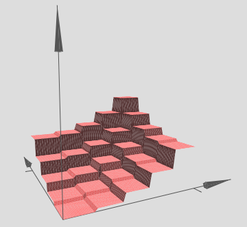
这是三维中的情况
**数学视角**  
• 单隐藏层：每个神经元定义一个超平面，将输入空间分成两部分。

• 多神经元组合：多个超平面将输入空间切割成多个凸区域，输出层加权组合这些区域。

• 深度网络：每一层进一步切割上一层的区域，形成指数级增长的复杂分区。

下图为用MLP形成螺旋形决策边界的示意图：
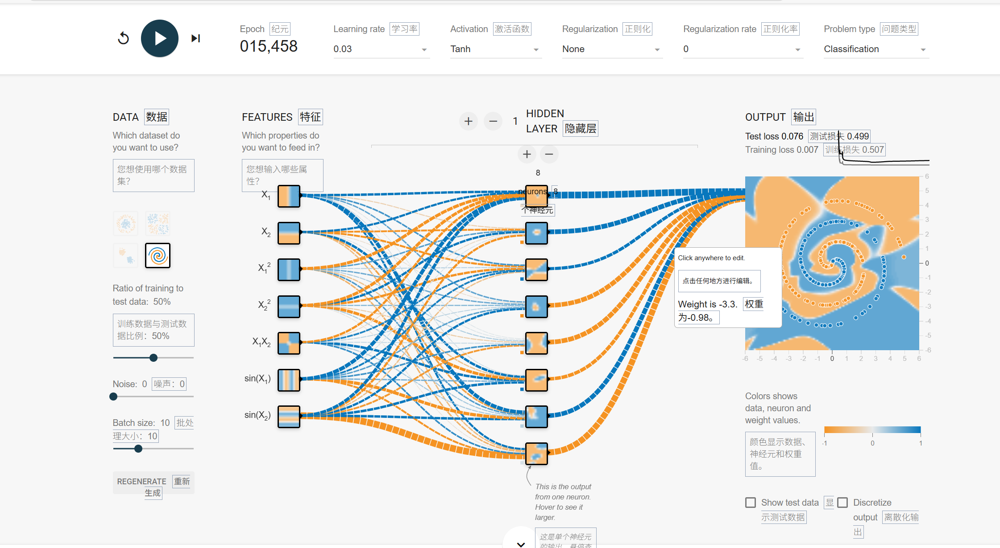
## 第5节：前向传播和损失函数

### 5.1. 前向传播 (Forward Propagation)
以下图为例
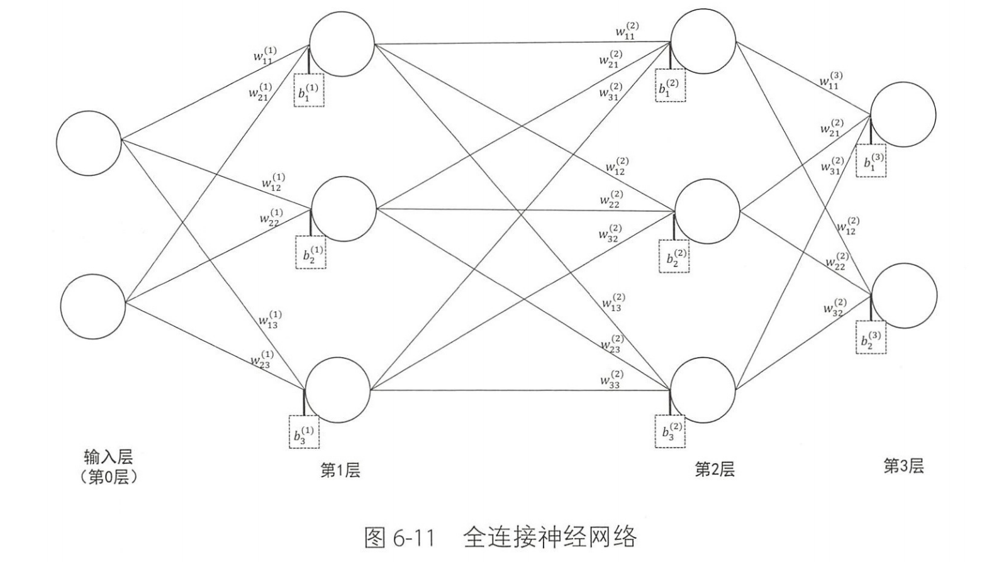

这张图展示了一个包含两个隐藏层（第1层和第2层）的全连接神经网络的前向计算链。

我们来一步步分解这个计算过程。我们假设：
* 输入层的输入为 $$x$$ ，它是一个包含 $$x_1$$ 和 $$x_2$$ 的向量。
* $$z^{(l)}$$ 表示第 $$l$$ 层的 **线性加权和**（即激活函数““吞””进去的东西）。
* $$a^{(l)}$$ 表示第 $$l$$ 层的 **激活输出**（即激活函数““吐””出来的东西）。
* $$f(\cdot)$$ 代表隐藏层使用的激活函数（例如 ReLU 或 Sigmoid）。
* $$g(\cdot)$$ 代表输出层（第3层）使用的激活函数（例如 Softmax 或线性函数）。

---

#### 计算链详解

**1. 从输入层 (第0层) $$\rightarrow$$ 第1层**

计算机会首先计算第1层中3个神经元的线性加权和 $$z^{(1)}$$。

* 第1个神经元： $$z_1^{(1)} = w_{11}^{(1)} x_1 + w_{21}^{(1)} x_2 + b_1^{(1)}$$
* 第2个神经元： $$z_2^{(1)} = w_{12}^{(1)} x_1 + w_{22}^{(1)} x_2 + b_2^{(1)}$$
* 第3个神经元： $$z_3^{(1)} = w_{13}^{(1)} x_1 + w_{23}^{(1)} x_2 + b_3^{(1)}$$

然后，这些 $$z$$ 值会通过激活函数 $$f$$ 得到第1层的输出 $$a^{(1)}$$：
* $$a_1^{(1)} = f(z_1^{(1)})$$
* $$a_2^{(1)} = f(z_2^{(1)})$$
* $$a_3^{(1)} = f(z_3^{(1)})$$

**2. 从第1层 $$\rightarrow$$ 第2层**

接下来，使用第1层的输出 $$a^{(1)}$$ 作为输入，计算第2层3个神经元的线性加权和 $$z^{(2)}$$。

* 第1个神经元： $$z_1^{(2)} = w_{11}^{(2)} a_1^{(1)} + w_{21}^{(2)} a_2^{(1)} + w_{31}^{(2)} a_3^{(1)} + b_1^{(2)}$$
* 第2个神经元： $$z_2^{(2)} = w_{12}^{(2)} a_1^{(1)} + w_{22}^{(2)} a_2^{(1)} + w_{32}^{(2)} a_3^{(1)} + b_2^{(2)}$$
* 第3个神经元： $$z_3^{(2)} = w_{13}^{(2)} a_1^{(1)} + w_{23}^{(2)} a_2^{(1)} + w_{33}^{(2)} a_3^{(1)} + b_3^{(2)}$$

同样，通过激活函数 $$f$$ 得到第2层的输出 $$a^{(2)}$$：
* $$a_1^{(2)} = f(z_1^{(2)})$$
* $$a_2^{(2)} = f(z_2^{(2)})$$
* $$a_3^{(2)} = f(z_3^{(2)})$$

**3. 从第2层 $$\rightarrow$$ 第3层 (输出层)**

最后，使用第2层的输出 $$a^{(2)}$$ 作为输入，计算第3层（输出层）2个神经元的线性加权和 $$z^{(3)}$$。

* 第1个神经元： $$z_1^{(3)} = w_{11}^{(3)} a_1^{(2)} + w_{21}^{(3)} a_2^{(2)} + w_{31}^{(3)} a_3^{(2)} + b_1^{(3)}$$
* 第2个神经元： $$z_2^{(3)} = w_{12}^{(3)} a_1^{(2)} + w_{22}^{(3)} a_2^{(2)} + w_{32}^{(3)} a_3^{(2)} + b_2^{(3)}$$

这些 $$z$$ 值通过 **输出层** 的激活函数 $$g$$ 得到最终的网络预测输出 $$a^{(3)}$$：
* $$a_1^{(3)} = g(z_1^{(3)})$$
* $$a_2^{(3)} = g(z_2^{(3)})$$


**总结 (矩阵形式)**

如果我们将每一层的 $$w, b, z, a$$ 都写成向量和矩阵的形式，这个计算链会更简洁：

1.  $$z^{(1)} = W^{(1)} x + b^{(1)}$$
2.  $$a^{(1)} = f(z^{(1)})$$
3.  $$z^{(2)} = W^{(2)} a^{(1)} + b^{(2)}$$
4.  $$a^{(2)} = f(z^{(2)})$$
5.  $$z^{(3)} = W^{(3)} a^{(2)} + b^{(3)}$$
6.  $$a^{(3)} = g(z^{(3)})$$

其中， $$W^{(1)}$$ 是一个 $$3 \times 2$$ 矩阵， $$W^{(2)}$$ 是一个 $$3 \times 3$$ 矩阵， $$W^{(3)}$$ 是一个 $$2 \times 3$$ 矩阵。 $$a^{(3)}$$ 就是这个网络最终的预测输出。

---

### 5.2.损失函数

#### 5.2.1. 误差的度量

前向传播（第4节）给了我们一个预测 $$A2$$。但这个预测有多好？我们需要一个函数来量化 $$A2$$（预测）与 $$Y$$（真实标签）之间的差距。这个函数就是**损失函数 (Loss Function)**。

#### 5.2.2. 交叉熵损失 (Cross-Entropy Loss)

对于分类问题，最常用的损失函数是**交叉熵损失 (Cross-Entropy Loss)** 1。

**理论：** 交叉熵源于信息论和最大似然估计，它用于衡量两个概率分布之间的差异。在二分类中，我们衡量的是“真实分布”（例如 $$Y^{(i)}=1$$）和“预测分布”（例如 $$A^{(i)}=0.9$$，即90%的概率为1）之间的“距离”。这比均方误差(MSE)更适合处理分类任务。

单样本损失 $$\mathcal{L}$$ (来自 1)：
对于第 $$i$$ 个样本，其损失 $$\mathcal{L}^{(i)}$$ 定义为：

$$\mathcal{L}^{(i)} = -Y^{(i)} \log(A^{(i)}) - (1-Y^{(i)}) \log(1-A^{(i)})$$

* 如果 $$Y^{(i)}=1$$，$$\mathcal{L}^{(i)} = -\log(A^{(i)})$$。$$A^{(i)}$$ 越接近1，损失越接近0。
* 如果 $$Y^{(i)}=0$$，$$\mathcal{L}^{(i)} = -\log(1-A^{(i)})$$。$$A^{(i)}$$ 越接近0，损失越接近0。

#### 5.2.3. 批成本函数 (Batch Cost Function)

在训练中，我们通常不会只看一个样本，而是看一批（batch）样本（例如 $$m=64$$ 个）。单个样本的损失可能充满噪声。

定义 (来自 1)：
成本函数 $$\mathcal{J}$$ 被定义为该批次 $$m$$ 个样本损失的平均值：

$$\mathcal{J} = \frac{1}{m} \sum_{i=1}^m \mathcal{L}^{(i)}$$

使用批平均成本 $$\mathcal{J}$$ 的目标是“确保一个稳定的梯度方向”，并“减少来自单个样本的噪声影响”，使学习过程更平滑。

---

### 5.3. 函数化
- 如果我们把这个网络写成一个函数：
    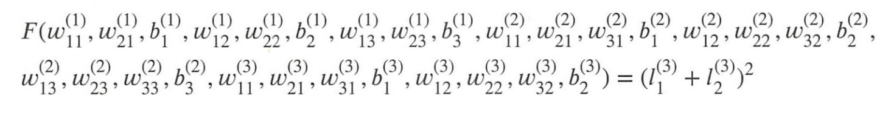
    其中
    $$
    (l_1^{(3)} + l_2^{(3)})^2
    $$
    可以理解为一个简化的损失函数（出于说明简单考虑），然后前面的F就是一个关于w，b的函数。

---

## 第6节：学习的引擎：反向传播（Backpropagation）与链式法则

### 6.1. 核心思想

我们有了一个成本函数 $$\mathcal{J}$$，它量化了我们的网络有多“差”。我们的目标是调整*所有*参数，使得 $$\mathcal{J}$$ 最小化。

**反向传播 (Backpropagation)** 就是实现这一目标的引擎。它是一种高效计算 $$\mathcal{J}$$ 对网络中*每一个*参数的偏导数（梯度）的算法。这个梯度（例如 $$\frac{\partial \mathcal{J}}{\partial W1}$$）告诉我们：“如果 $$W1$$ 增加一点点，$$\mathcal{J}$$ 会增加多少？”


---
### 6.2. 具体过程
F关于中间变量的偏导数同样可以由网络计算
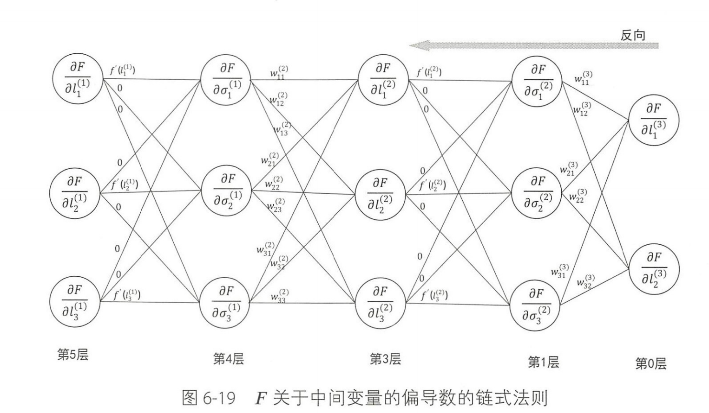
#### 1. (第0层 $$\rightarrow$$ 第1层): 计算对 $$\sigma^{(2)}$$ 的梯度

这是将梯度从 $$l^{(3)}$$ (第0层) 传到 $$\sigma^{(2)}$$ (第1层)。

* **计算链:** $$\frac{\partial F}{\partial \sigma^{(2)}} = \left(\frac{\partial l^{(3)}}{\partial \sigma^{(2)}}\right)^T \frac{\partial F}{\partial l^{(3)}}$$
* **关键点:** 在前向传播中， $$l^{(3)} = W^{(3)} \sigma^{(2)} + b^{(3)}$$。因此， $$\partial l^{(3)} / \partial \sigma^{(2)}$$ 恰好是 $$W^{(3)}$$。
* **矩阵化公式:**
    $$ \frac{\partial F}{\partial \sigma^{(2)}} = (W^{(3)})^T \frac{\partial F}{\partial l^{(3)}} $$
* **展开 (对应图示):**
    $$
    \begin{bmatrix} \partial F / \partial \sigma_1^{(2)} \\ \partial F / \partial \sigma_2^{(2)} \\ \partial F / \partial \sigma_3^{(2)} \end{bmatrix} = \begin{bmatrix} w_{11}^{(3)} & w_{12}^{(3)} \\ w_{21}^{(3)} & w_{22}^{(3)} \\ w_{31}^{(3)} & w_{32}^{(3)} \end{bmatrix} \begin{bmatrix} \partial F / \partial l_1^{(3)} \\ \partial F / \partial l_2^{(3)} \end{bmatrix}
    $$
    (“反向来看，相当于对原本的 $$w$$ 矩阵转置后相乘。”)

---

#### 2. (第1层 $$\rightarrow$$ 第3层): 计算对 $$l^{(2)}$$ 的梯度

这是将梯度从 $$\sigma^{(2)}$$ (第1层) ““穿过””激活函数，传到 $$l^{(2)}$$ (第3层)。

* **计算链:** $$\frac{\partial F}{\partial l_j^{(2)}} = \frac{\partial F}{\partial \sigma_j^{(2)}} \cdot \frac{d \sigma_j^{(2)}}{d l_j^{(2)}}$$
* **关键点:** 在前向传播中， $$\sigma^{(2)} = f(l^{(2)})$$ 是一个 **逐元素 (element-wise)** 的运算。因此， $$\sigma_j^{(2)}$$ 只依赖于 $$l_j^{(2)}$$，其导数是 $$f'(l_j^{(2)})$$ (图中箭头上的标签)。
* **矩阵化公式:**
    这是一个逐元素相乘，也称为 **哈达玛积 (Hadamard Product)**，记为 $$\odot$$。
    $$ \frac{\partial F}{\partial l^{(2)}} = \frac{\partial F}{\partial \sigma^{(2)}} \odot f'(l^{(2)}) $$
* **展开 (对应图示):**
    $$
    \begin{bmatrix} \partial F / \partial l_1^{(2)} \\ \partial F / \partial l_2^{(2)} \\ \partial F / \partial l_3^{(2)} \end{bmatrix} = \begin{bmatrix} \partial F / \partial \sigma_1^{(2)} \\ \partial F / \partial \sigma_2^{(2)} \\ \partial F / \partial \sigma_3^{(2)} \end{bmatrix} \odot \begin{bmatrix} f'(l_1^{(2)}) \\ f'(l_2^{(2)}) \\ f'(l_3^{(2)}) \end{bmatrix}
    $$

---

#### 3. (第3层 $$\rightarrow$$ 第4层): 计算对 $$\sigma^{(1)}$$ 的梯度

这与第1步完全相同，是将梯度从 $$l^{(2)}$$ (第3层) 传到 $$\sigma^{(1)}$$ (第4层)。

* **计算链:** $$\frac{\partial F}{\partial \sigma^{(1)}} = \left(\frac{\partial l^{(2)}}{\partial \sigma^{(1)}}\right)^T \frac{\partial F}{\partial l^{(2)}}$$
* **关键点:** 在前向传播中， $$l^{(2)} = W^{(2)} \sigma^{(1)} + b^{(2)}$$。
* **矩阵化公式:**
    $$ \frac{\partial F}{\partial \sigma^{(1)}} = (W^{(2)})^T \frac{\partial F}{\partial l^{(2)}} $$
* **展开 (对应图示):**
    $$
    \begin{bmatrix} \partial F / \partial \sigma_1^{(1)} \\ \partial F / \partial \sigma_2^{(1)} \\ \partial F / \partial \sigma_3^{(1)} \end{bmatrix} = (W^{(2)})^T \begin{bmatrix} \partial F / \partial l_1^{(2)} \\ \partial F / \partial l_2^{(2)} \\ \partial F / \partial l_3^{(2)} \end{bmatrix}
    $$
    (这里的 $$W^{(2)}$$ 是一个 $$3 \times 3$$ 矩阵)

---

#### 4. (第4层 $$\rightarrow$$ 第5层): 计算对 $$l^{(1)}$$ 的梯度

这与第2步相同，是将梯度从 $$\sigma^{(1)}$$ (第4层) ““穿过””激活函数，传到 $$l^{(1)}$$ (第5层)。

* **计算链:** $$\frac{\partial F}{\partial l^{(1)}} = \frac{\partial F}{\partial \sigma^{(1)}} \odot f'(l^{(1)})$$
* **矩阵化公式:**
    $$ \frac{\partial F}{\partial l^{(1)}} = \frac{\partial F}{\partial \sigma^{(1)}} \odot f'(l^{(1)}) $$
* **展开 (对应图D_F_sigma1):**
    $$
    \begin{bmatrix} \partial F / \partial l_1^{(1)} \\ \partial F / \partial l_2^{(1)} \\ \partial F / \partial l_3^{(1)} \end{bmatrix} = \begin{bmatrix} \partial F / \partial \sigma_1^{(1)} \\ \partial F / \partial \sigma_2^{(1)} \\ \partial F / \partial \sigma_3^{(1)} \end{bmatrix} \odot \begin{bmatrix} f'(l_1^{(1)}) \\ f'(l_2^{(1)}) \\ f'(l_3^{(1)}) \end{bmatrix}
    $$

这个过程会一直持续下去，直到计算出 $$F$$ 对 $$W^{(1)}, b^{(1)}$$ 和输入 $$x$$ 的梯度。


### 6.3. 具体算例：
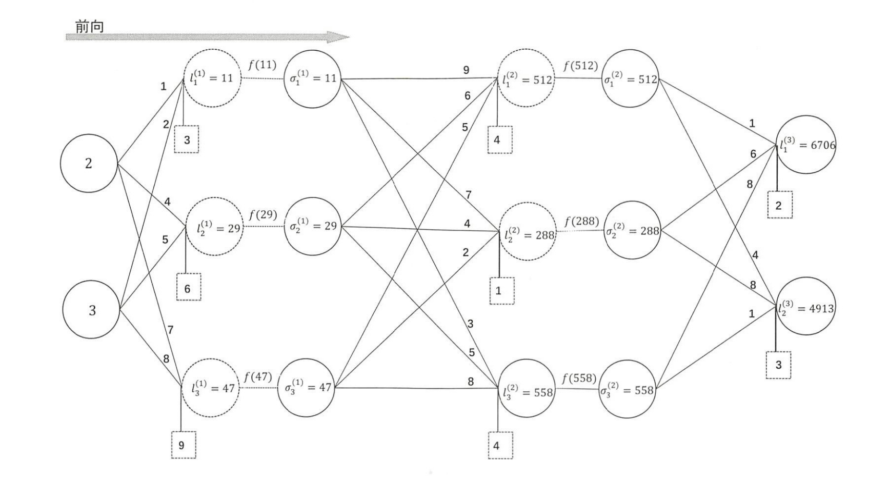

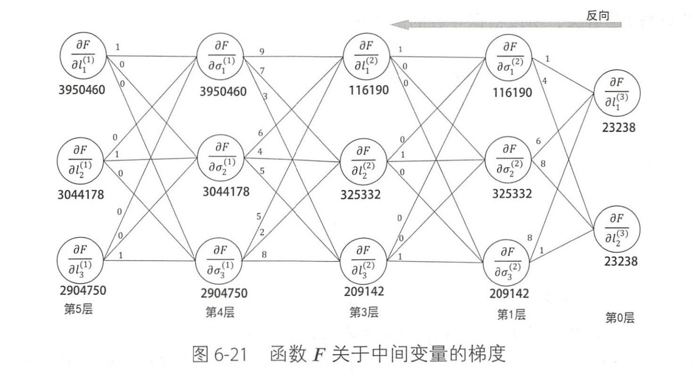

- **其实这是很重要的点，即反向来看，相当于对原本的w矩阵转置后相乘。**
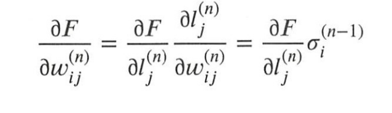

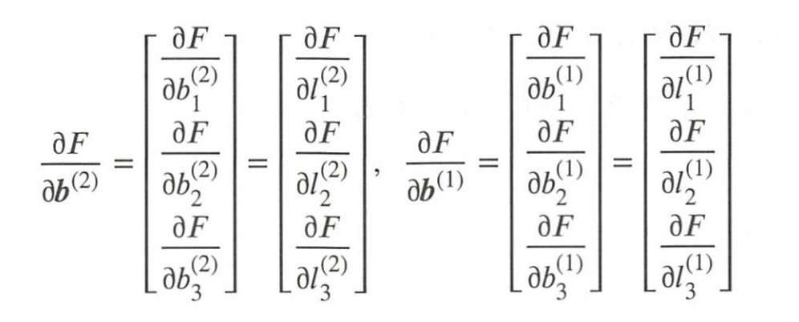
---

## 第7节：优化过程：梯度下降（Gradient Descent）

### 7.1. 参数更新法则

在第6节中，我们费尽心力地计算出了 $$\mathcal{J}$$ 对所有参数的梯度（$$dW1, db1, dW2, db2$$）。现在，我们使用**梯度下降（Gradient Descent）**算法来利用这些梯度更新参数。

**理论：** 梯度（例如 $$\frac{\partial \mathcal{J}}{\partial W}$$）指向成本函数 $$\mathcal{J}$$ *上升*最快的方向。为了*最小化* $$\mathcal{J}$$，我们必须朝着梯度的*相反*方向迈出一小步。

1 参数更新法则：
如 1 所示，参数更新的通用规则是：

$$W_{\text{new}} = W - \alpha \cdot \frac{\partial \mathcal{J}}{\partial W}$$
$$b_{\text{new}} = b - \alpha \cdot \frac{\partial \mathcal{J}}{\partial b}$$

其中 $$\alpha$$ 是学习率 (Learning Rate) 1。


### 7.2. 学习率 $$\alpha$$ (Learning Rate)

学习率 $$\alpha$$是一个至关重要的超参数，它控制着我们“迈出的一小步”有多大。

* **$$\alpha$$ 太大：** 可能会导致“步子迈得太大”，跨过了最低点，导致成本函数“剧烈震荡”甚至发散。
* **$$\alpha$$ 太小：** 学习过程会极其缓慢，需要非常多的迭代才能收敛到最低点。
* **$$\alpha$$ 刚刚好：** 能够高效、稳定地收敛。

### 7.3. 批 (Batch) vs. 小批 (Mini-Batch) 梯度下降

计算所有 $$m$$ 个样本的平均梯度被称为**批梯度下降 (Batch Gradient Descent)**。

在实践中，当数据集非常大时（例如数百万个样本），一次性计算所有样本的梯度成本太高。因此，我们更常使用**小批 (Mini-Batch) 梯度下降**。我们将数据分成若干个“小批”（例如，每批 $$m=32$$ 或 $$m=64$$），每次迭代只在一个小批上计算梯度并更新参数。这在计算效率（可并行）和梯度稳定性之间取得了完美的平衡。

---

## 第8节：梯度爆炸与梯度消失

我们已经构建了完整的两层网络（第5节），定义了它的目标（第5节），并设计了学习算法（第6、7节）。然而，当网络变得更深（层数更多）或数据更复杂时，这个学习过程往往会变得非常不稳定。在引入高级优化技术（第9节）之前，我们必须理解训练失败的根源。

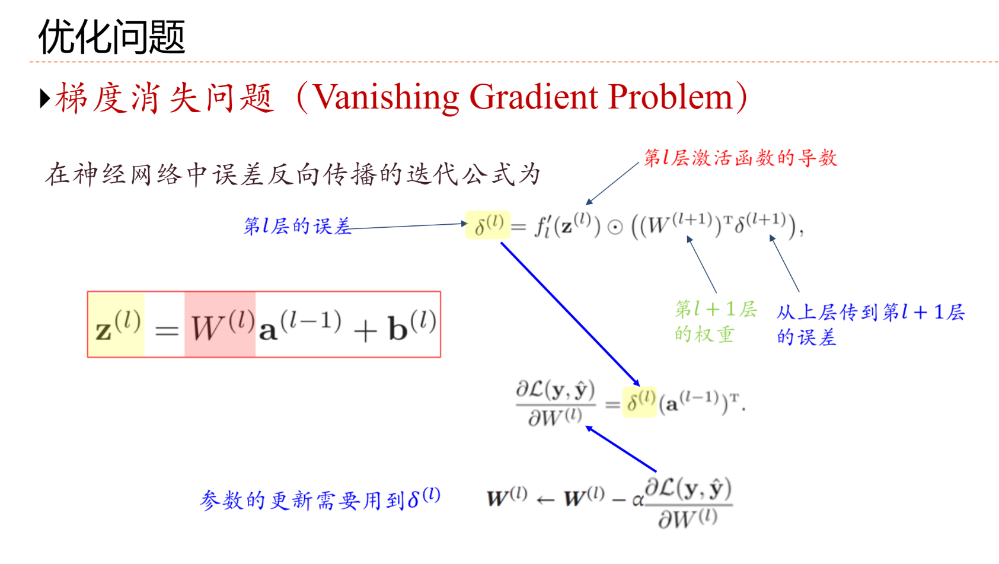
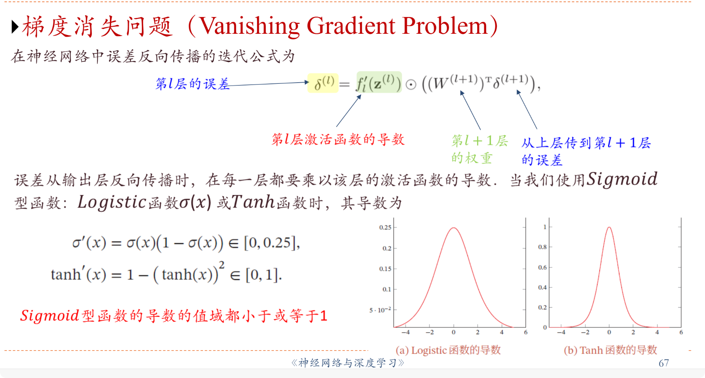
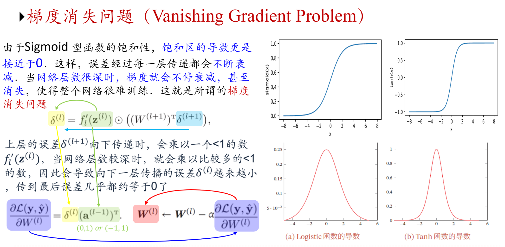
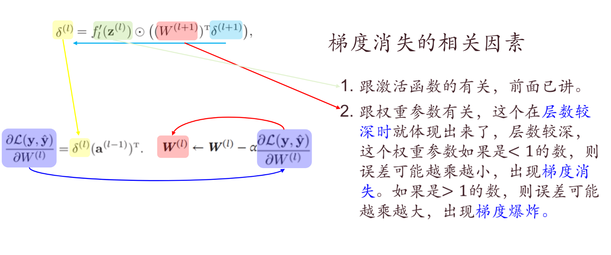

---

## 第9节：稳定网络：归一化 (Normalization) 的理论与实践

为了解决第8节中提出的四大难题，研究者们引入了**归一化 (Normalization)** 技术。归一化层被插入到线性层（$$Z$$）和激活层（$$A$$）之间，其目的是重新调整数据的分布，使训练更稳定、更快速。

1 中详细讨论了两种最核心的归一化技术：批量归一化 (BN) 和层归一化 (LN)。

### 9.1. 批量归一化 (Batch Normalization, BN)

**核心思想：** BN 在**批处理 (batch, $$m$$)** 维度上进行归一化。它假设批处理中的所有样本在*同一个特征通道*上的激活值是相关的 。

数学公式 ：
对于一个 $$m \times d$$ 的 mini-batch 输入 $$x$$（$$m$$是批大小，$$d$$是特征维度）：

1.  **计算批处理均值 $$\mu_B$$**（在批 $$m$$ 维度上）：
    $$\mu_B = \frac{1}{m} \sum_{i=1}^m x_i$$
2.  **计算批处理方差 $$\sigma_B^2$$**（在批 $$m$$ 维度上）：
    $$\sigma_B^2 = \frac{1}{m} \sum_{i=1}^m (x_i - \mu_B)^2$$
3.  **归一化 $$\hat{x}_i$$**（$$\epsilon$$ 是为防止除零而加的极小值，如 $$10^{-5}$$）：
    $$\hat{x}_i = \frac{x_i - \mu_B}{\sqrt{\sigma_B^2 + \epsilon}}$$
4.  **缩放与平移 (Scale & Shift) $$y_i$$：**
    $$y_i = \gamma \hat{x}_i + \beta$$

$$\gamma$$ 和 $$\beta$$ 的理论解释：
为什么在将数据强制归一化为 $$\mu=0, \sigma=1$$ 之后，又要通过 $$\gamma$$（缩放）和 $$\beta$$（平移）将其“变回去”？
答案是可以“**恢复网络的表达能力**”。

强制将所有激活都变为标准正态分布可能过于严格，限制了网络的表达力（例如，如果网络“希望”一个Sigmoid神经元处于饱和区）。$$\gamma$$ 和 $$\beta$$ 是*可学习的*参数。它们允许网络在训练中*自己决定*最佳的分布，从“完全归一化”（$$\gamma=1, \beta=0$$）到“什么都不做”（$$\gamma=\sigma_B, \beta=\mu_B$$）之间的任意状态。

### 9.2. 层归一化 (Layer Normalization, LN)

**核心思想：** LN 在**特征 (feature, $$d$$)** 维度上对*单个样本*进行归一化。它不依赖于批处理中的其他样本，而是假设*单个样本*的*所有特征*在统计上是相关的。

数学公式 ：
对于一个 $$d$$ 维的单个特征向量 $$x$$：

1.  **计算特征均值 $$\mu$$**（在特征 $$d$$ 维度上）：
    $$\mu = \frac{1}{d} \sum_{i=1}^d x_i$$
2.  **计算特征方差 $$\sigma^2$$**（在特征 $$d$$ 维度上）：
    $$\sigma^2 = \frac{1}{d} \sum_{i=1}^d (x_i - \mu)^2$$
3.  **归一化 $$\hat{x}_i$$**：
    $$\hat{x}_i = \frac{x_i - \mu}{\sqrt{\sigma^2 + \epsilon}}$$
4.  **缩放与平移 (Scale & Shift) $$y_i$$：**
    $$y_i = \gamma \hat{x}_i + \beta$$

同样，$$\gamma$$ 和 $$\beta$$ 被引入以“调整归一化后的分布”，作为可学习的参数来保持网络的表达能力。

### 9.3. 归一化如何解决训练难题（以LN为例）


1.  **解决数值稳定/梯度爆炸 (问题1)：**
    归一化将激活值“压缩”到了一个安全、合理的范围内。在前面的例子中，未归一化的极端输入 $$x_2=200$$ 导致激活值 $$h_2=110$$ 和梯度 $$200$$。而LN将 $$h_2$$ 压缩到 $$1$$，导致梯度也相应地缩小到 $$3.64$$，从而“避免了爆炸和溢出的风险” 。
2.  **解决死神经元/参数冻结 (问题2)：**
    LN通过将输入中心化到零点附近，“降低了ReLU神经元死亡的概率”。这确保了激活值不会轻易地持续落入ReLU的负半轴（即 $$z<0$$ 的区域）。归一化后，“所有参数梯度都是非零的，都是可学习的” 。
3.  **解决尺度敏感/梯度耦合 (问题3)：**
    这是归一化最深刻的贡献。归一化实现了“数学解耦 (Mathematical Decoupling)”。
    * 它“消除了这种耦合”，因为它使得归一化后的激活 $$\hat{z}_i$$ 的幅度“与输入的绝对数值无关” 。
    * 数学解释：在反向传播中，梯度被 $$1/\sigma$$ 因子“**阻尼 (damped)**”（即重新缩放）。
    * **推演：** 如果输入 $$x$$ 被缩放了 $$k$$ 倍，那么它的方差 $$\sigma$$ 也会被缩放 $$k$$ 倍。在反向传播中，这个 $$k$$ 倍的 $$\sigma$$ 会产生一个 $$1/k$$ 倍的阻尼因子。这个 $$1/k$$ 因子会*抵消*掉输入 $$x$$ 带来的 $$k$$ 倍缩放。
    * **结论：** 最终的权重梯度 $$\partial L/\partial W$$ 变得“与输入幅度$$k$$无关” 。归一化*解耦*了参数的学习率（由 $$\alpha$$ 控制）与数据的任意尺度（由 $$x$$ 控制），使得优化过程对输入尺度不再敏感。
4.  **解决信号传播/ICS (问题4)：**
    LN确保了每一层网络的输出分布“被稳定”（通常稳定在 $$\mu=0, \sigma=1$$ 附近）。这解决了“内部协变量偏移”问题，允许“均匀的梯度传播”，避免了“数值范围逐层漂移” 。

### 9.4. 理论对比：Batch Normalization vs. Layer Normalization

BN和LN的选择不是随意的，而是由数据的内在结构和假设决定的。BN在“样本之间” (inter-sample) 归一化，而LN在“样本内部” (intra-sample) 归一化。


**Batch Normalization (BN) vs. Layer Normalization (LN) 理论对比**

| 特性 | Batch Normalization (BN) | Layer Normalization (LN) |
| :--- | :--- | :--- |
| **归一化维度** | 跨**批处理 (N)** 维度  | 跨**特征 (D)** 维度  |
| **计算统计量** | 对一个 mini-batch 的*所有样本*计算 ($$\mu_B, \sigma_B^2$$) | 对*单个样本*的*所有特征*计算 ($$\mu, \sigma^2$$) |
| **数据假设** | 样本间 (Inter-sample) 独立同分布 (i.i.d.) (适合CV) | 样本内 (Intra-sample) 特征相关 (适合NLP) |
| **适用领域** | 计算机视觉 (CV), 卷积神经网络 (CNNs) | 自然语言处理 (NLP), Transformers, RNNs |
| **对Batch Size的敏感性** | **高**。小batch (e.g., < 4) 会导致统计量不准 | **无**。计算与batch size完全无关 |
| **对序列长度 (NLP)** | **不适用**。变长序列导致统计不一致  | **适用**。在每个时间步上独立计算 |
| **位置信息 (NLP)** | **破坏性**。混合了不同位置的统计数据  | **保留**。只在特征维度归一化，不跨位置  |
| **训练 vs. 推理** | **不一致**。推理时需存储和使用训练时的 $$\mu_B, \sigma_B^2$$ | **一致**。训练和推理时计算完全相同 |
| **资源开销** | 推理时有“计算和存储开销”  | 无额外开销  |

### 10. 手撕实现与实验结果

对应到代码tlnn.py。

#### 10.1 参数初始化（网络的“骨架”）

对应代码位置：TwoLayerMLP.__init__
```
self.W1 = np.random.randn(hidden_size, input_size) * std
self.b1 = np.zeros((hidden_size, 1))
self.W2 = np.random.randn(output_size, hidden_size) * std
self.b2 = np.zeros((output_size, 1))
```
这一部分明确手动定义了网络中所有可学习参数：
- W1, b1：输入层 → 隐藏层
- W2, b2：隐藏层 → 输出层

权重采用小尺度随机初始化，偏置初始化为 0，保证网络在训练开始时不会因对称性导致所有神经元行为一致。这一步决定了网络“长什么样”，是后续所有计算的基础。

#### 10.2 前向传播的手动实现

对应代码位置：TwoLayerMLP.forward

```
Z1 = np.dot(self.W1, X) + self.b1
A1 = sigmoid(Z1)
Z2 = np.dot(self.W2, A1) + self.b2
A2 = softmax(Z2)
```
前向传播过程被完整拆解为线性计算 + 激活函数两部分：

输入数据 X 与 W1 做矩阵乘法，加偏置 b1

隐藏层使用 Sigmoid 激活函数

隐藏层输出再与 W2 相乘并加 b2

输出层使用 Softmax 得到各类别概率

同时，所有中间变量被存入 cache，用于后续反向传播。

#### 10.3 损失函数的手写计算
对应代码位置：TwoLayerMLP.compute_loss
```
log_probs = np.log(A2 + 1e-9)
cost = - (1 / m) * np.sum(Y * log_probs)
```
损失函数采用交叉熵损失，其实现方式为：
- 对预测概率 A2 取对数
- 与真实标签的 one-hot 编码 Y 按元素相乘
- 对 batch 内样本求平均

在实现中手动加入 1e-9，避免数值为 0 时出现 log(0) 的数值错误。

#### 10.4 反向传播的显式推导与实现（手撕核心）
对应代码位置：TwoLayerMLP.backward
```
dZ2 = A2 - Y
dW2 = (1 / m) * np.dot(dZ2, A1.T)
db2 = (1 / m) * np.sum(dZ2, axis=1, keepdims=True)
```
输出层的梯度直接由预测概率与真实标签之差得到，随后显式计算：
- 输出层权重梯度 dW2
- 输出层偏置梯度 db2
- 
接着，梯度被继续向前传播到隐藏层：
```
dA1 = np.dot(self.W2.T, dZ2)
dZ1 = dA1 * sigmoid_derivative(A1)
dW1 = (1 / m) * np.dot(dZ1, X.T)
db1 = (1 / m) * np.sum(dZ1, axis=1, keepdims=True)
```
这一过程完整体现了反向传播的本质：
- 梯度沿权重矩阵反向传递
- 结合激活函数导数修正误差
- 对每一层参数分别计算梯度

#### 10.5 参数更新（学习发生的地方）
对应代码位置：TwoLayerMLP.update_parameters
```
self.W1 -= learning_rate * grads["dW1"]
self.b1 -= learning_rate * grads["db1"]
self.W2 -= learning_rate * grads["dW2"]
self.b2 -= learning_rate * grads["db2"]
```
这里使用最基础的梯度下降法：
- 梯度由反向传播给出
- 学习率控制更新步长
- 参数被直接原地修改

---
#### 10.6 训练流程的手动组织
对应代码位置：TwoLayerMLP.fit

数据随机打乱（防止批次偏置），小批量数据切分，对每个 batch 顺序执行：
- 前向传播
- 损失计算
- 反向传播
- 参数更新

#### 10.7 实验结果简述
实验结果表明，手撕实现的两层全连接神经网络能够在 MNIST 手写数字识别任务上取得稳定且较高的性能。训练过程中，损失函数随迭代轮数持续下降，从初始的 0.736 逐步收敛至约 0.005，且未出现明显震荡或发散现象，说明模型训练过程稳定，参数更新有效。

在测试集上的最终分类准确率达到 98.01%，在仅包含单隐层的全连接网络结构下，该结果已接近经典基线水平，表明模型具备良好的泛化能力。预测结果可视化显示，模型能够正确识别不同书写风格、粗细和形态的数字，说明其对输入特征具有较强的表达能力。

总体来看，实验结果验证了所实现网络结构及训练流程的正确性，也说明通过手动实现前向传播、反向传播和梯度下降等核心步骤，可以在不依赖深度学习框架的情况下完成有效的图像分类任务。