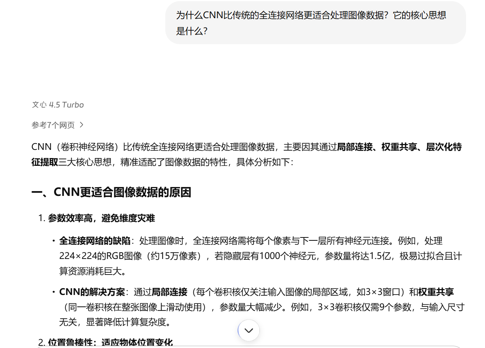
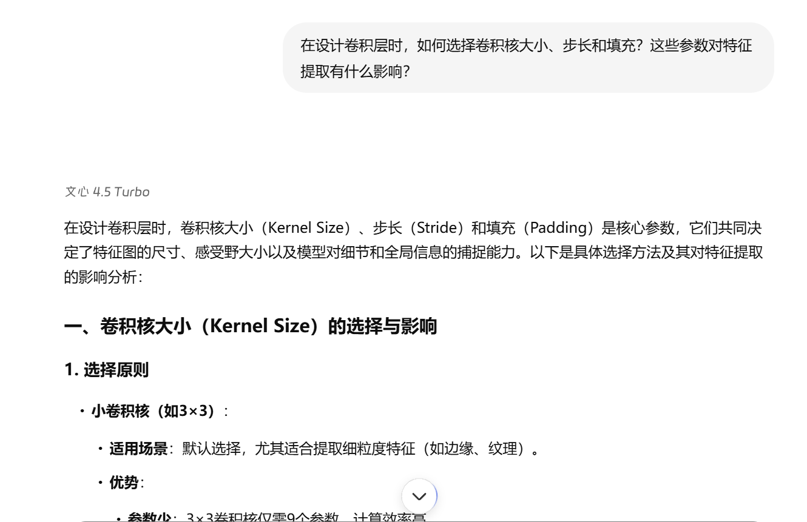
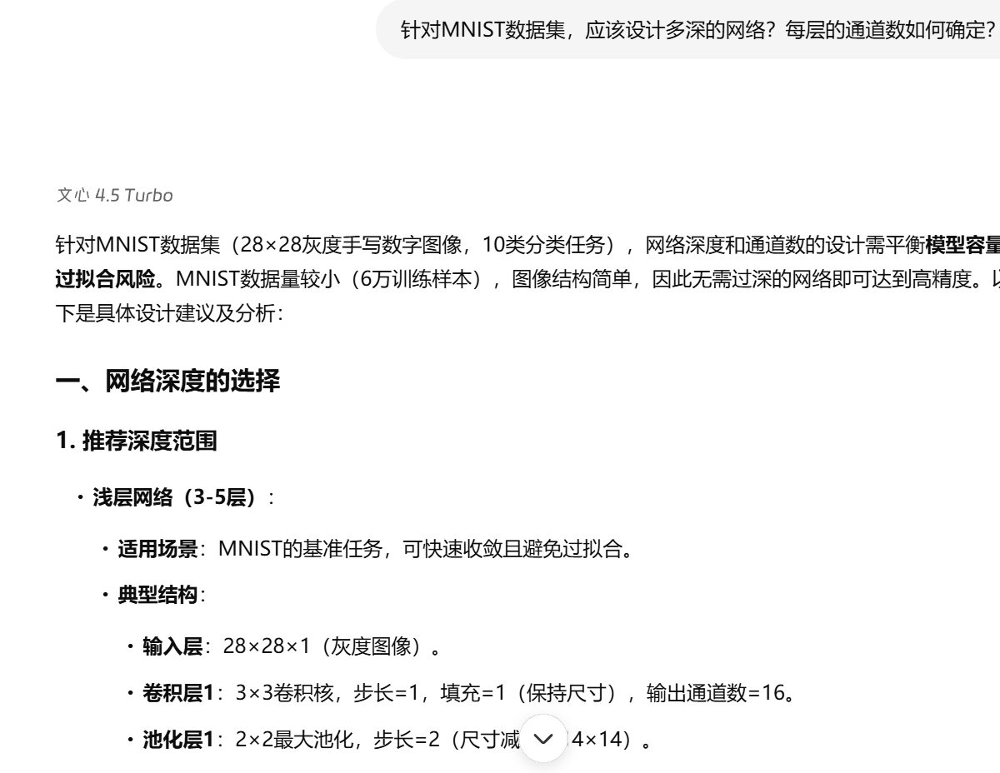
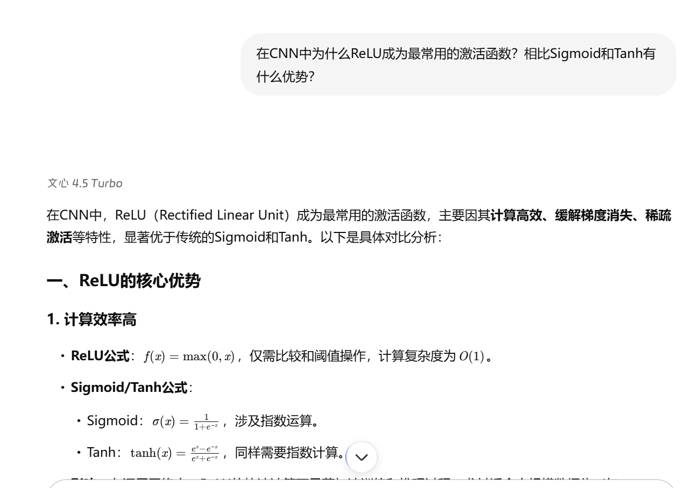
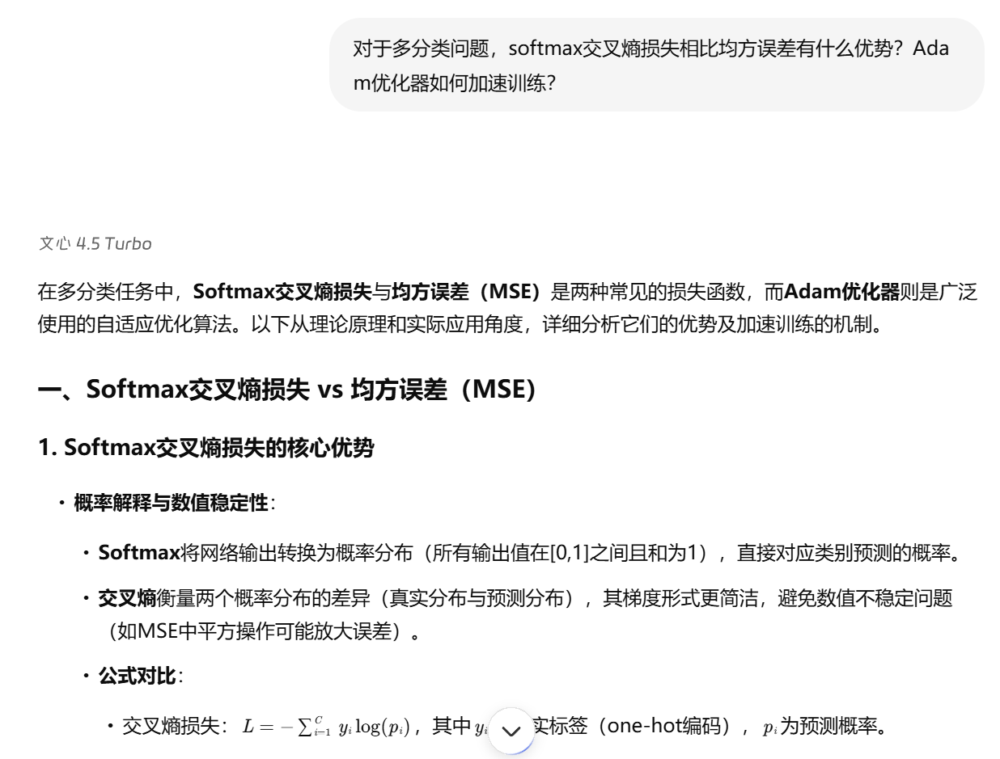
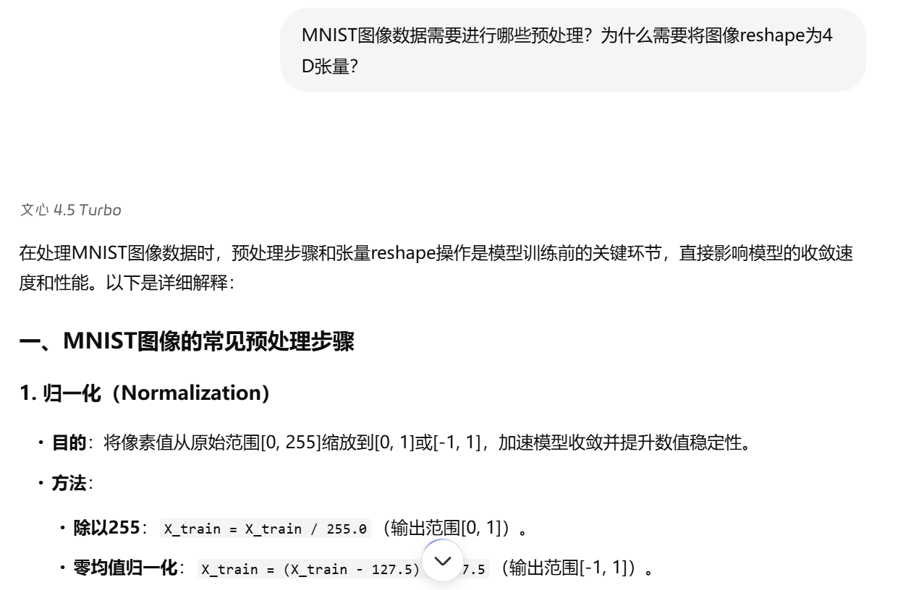
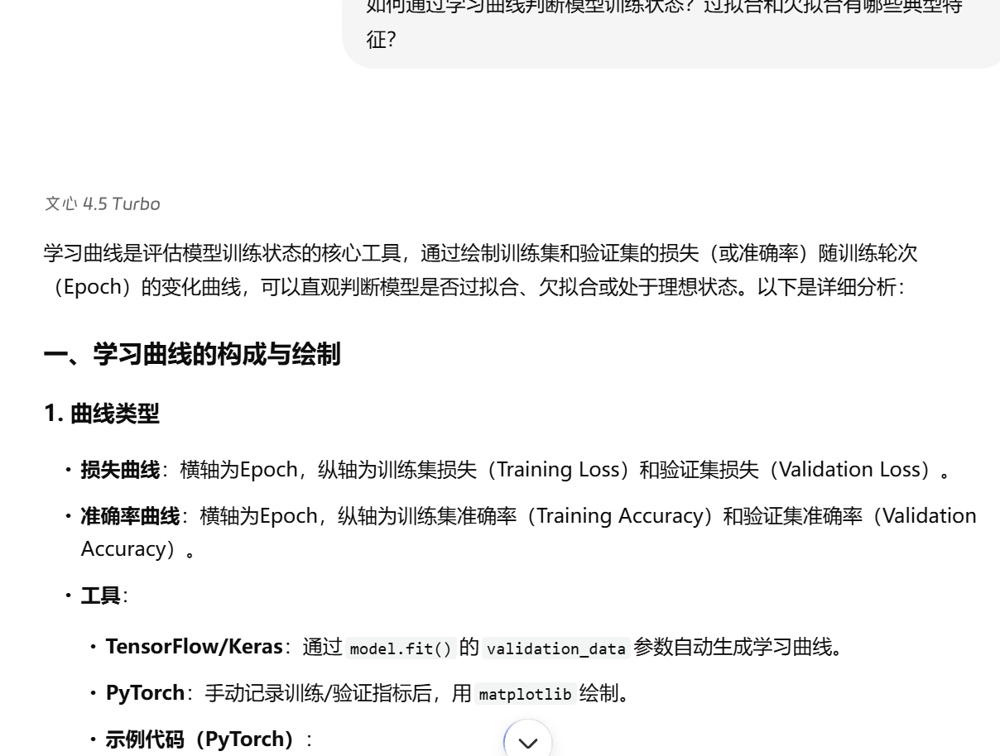
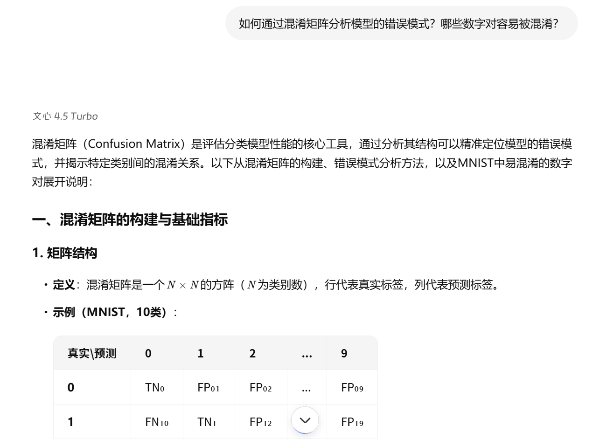
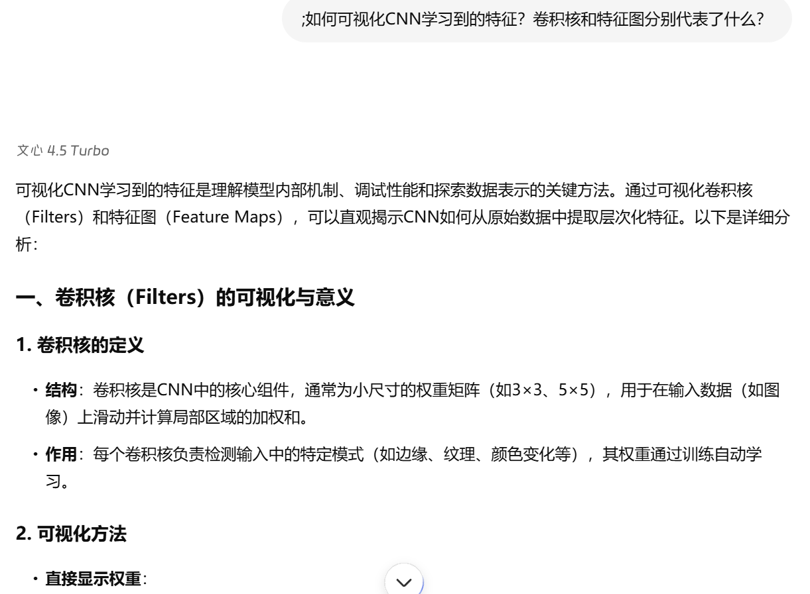
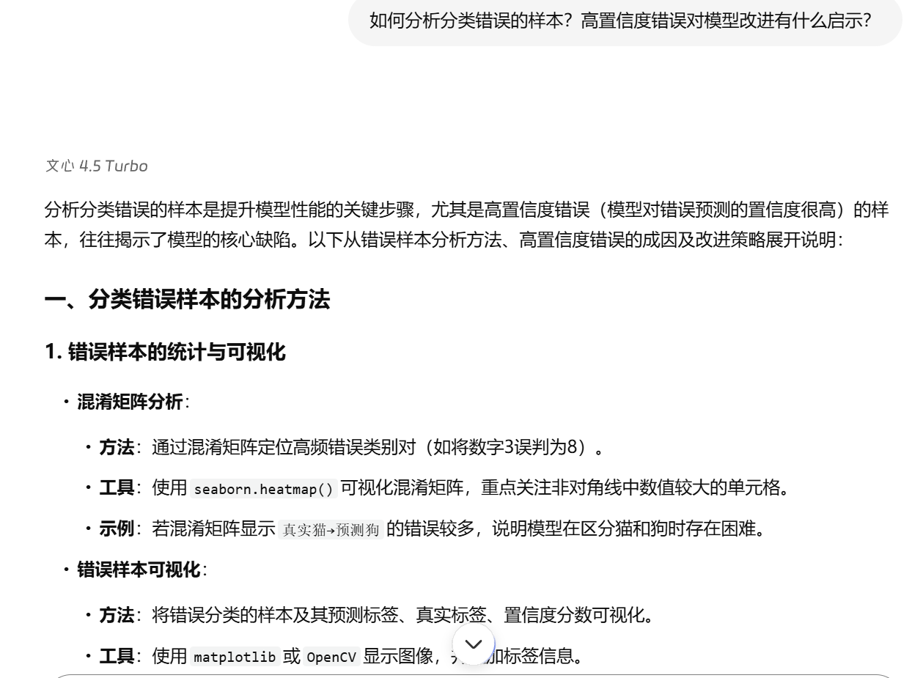

# 协作日志：与 LLM 共创卷积神经网络分类器

**项目阶段**：小作业 2 - 卷积神经网络 (Convolutional Neural Network, CNN)  
**协作伙伴**：百度文心一言大模型

---

## 第一部分：CNN 基础原理理解

### 探索点 1：CNN 的核心优势

> **我们提出的问题:**  
> &emsp;&emsp;为什么CNN比传统的全连接网络更适合处理图像数据？它的核心思想是什么？

&emsp;&emsp;通过对话，我们理解了CNN通过局部连接、权值共享和空间层次结构来有效提取图像特征，大大减少了参数数量并保持了平移不变性。

### 探索点 2：卷积层参数设计

> **我们提出的问题:**  
> &emsp;&emsp;在设计卷积层时，如何选择卷积核大小、步长和填充？这些参数对特征提取有什么影响？

&emsp;&emsp;LLM解释了不同参数组合的效果，我们最终选择3×3卷积核、步长1、填充1的方案，在保持特征图尺寸的同时提取局部特征。

---

## 第二部分：网络架构设计

### 探索点 3：网络深度与宽度

> **我们提出的问题:**  
> &emsp;&emsp;针对MNIST数据集，应该设计多深的网络？每层的通道数如何确定？

&emsp;&emsp;我们采用了2层卷积+2层全连接的架构，通道数从16逐步增加到32，实现了从简单到复杂的特征学习。

### 探索点 4：激活函数选择

> **我们提出的问题:**  
> &emsp;&emsp;在CNN中为什么ReLU成为最常用的激活函数？相比Sigmoid和Tanh有什么优势？

&emsp;&emsp;我们了解到ReLU能够有效缓解梯度消失问题，计算简单且收敛速度快，决定在所有隐藏层使用ReLU激活函数。

---

## 第三部分：训练策略优化

### 探索点 5：损失函数与优化器

> **我们提出的问题:**  
> &emsp;&emsp;对于多分类问题，softmax交叉熵损失相比均方误差有什么优势？Adam优化器如何加速训练？

&emsp;&emsp;我们采用softmax交叉熵损失函数配合Adam优化器，利用自适应学习率特性实现稳定快速的收敛。

### 探索点 6：数据预处理

> **我们提出的问题:**  
> &emsp;&emsp;MNIST图像数据需要进行哪些预处理？为什么需要将图像reshape为4D张量？

&emsp;&emsp;我们实现了数据归一化并将图像reshape为(batch, channel, height, width)格式，满足卷积层的输入要求。

---

## 第四部分：模型评估分析

### 探索点 7：训练过程监控

> **我们提出的问题:**  
> &emsp;&emsp;如何通过学习曲线判断模型训练状态？过拟合和欠拟合有哪些典型特征？

&emsp;&emsp;我们实现了训练损失和测试准确率的实时监控，能够及时发现过拟合现象并调整训练策略。

### 探索点 8：混淆矩阵分析

> **我们提出的问题:**  
> &emsp;&emsp;如何通过混淆矩阵分析模型的错误模式？哪些数字对容易被混淆？

&emsp;&emsp;通过混淆矩阵可视化，我们发现9和4、7和1等形状相似的数字对分类难度较大，这反映了人类视觉识别中的常见困惑。

---

## 第五部分：可视化与调试

### 探索点 9：特征可视化

> **我们提出的问题:**  
> &emsp;&emsp;如何可视化CNN学习到的特征？卷积核和特征图分别代表了什么？

&emsp;&emsp;我们实现了卷积核权重和特征激活图的可视化，直观展示了CNN从边缘、角点到复杂模式的特征学习过程。

### 探索点 10：错误样本分析

> **我们提出的问题:**  
> &emsp;&emsp;如何分析分类错误的样本？高置信度错误对模型改进有什么启示？

&emsp;&emsp;我们特别关注高置信度的错误分类样本，这些"顽固错误"往往揭示了模型的系统性偏差，为后续改进提供了方向。

---

**总结**：通过与 LLM 的深入协作，我们系统性地掌握了CNN从原理理解、架构设计、训练优化到评估分析的完整流程。这次合作不仅帮助我们成功实现了MNIST手写数字识别任务，更重要的是建立了对深度学习模型开发方法的深刻理解，为后续更复杂的计算机视觉任务奠定了坚实基础。