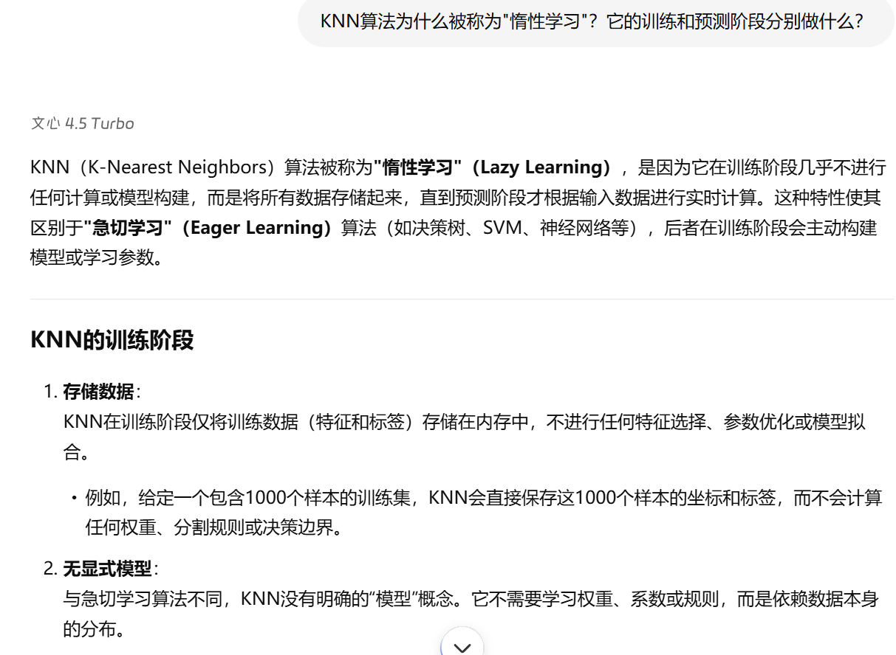
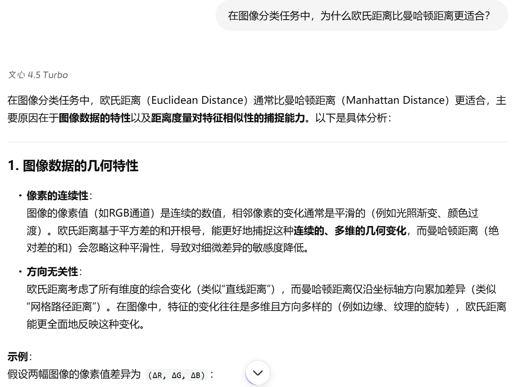
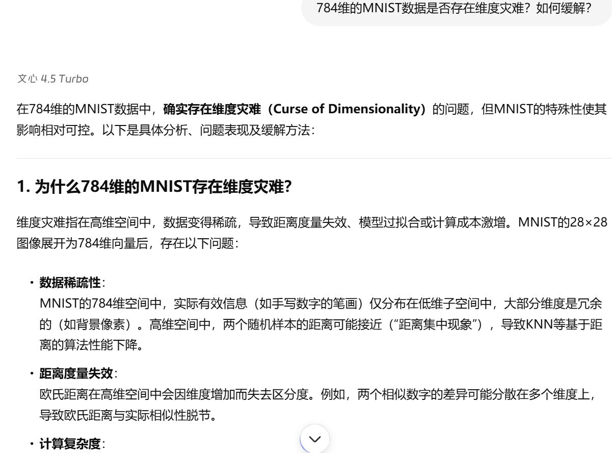
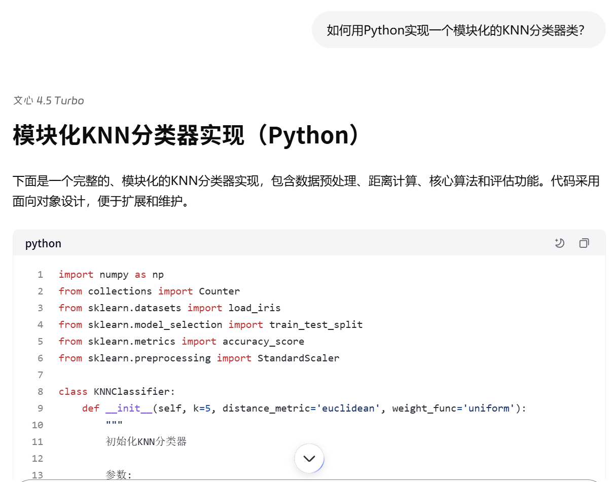
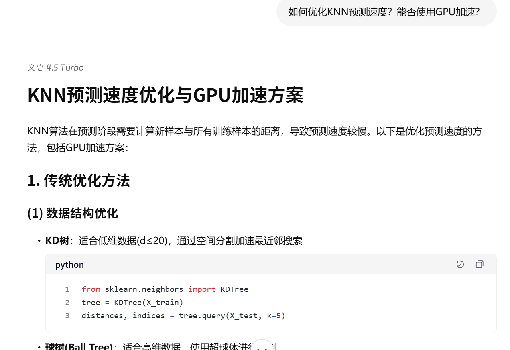
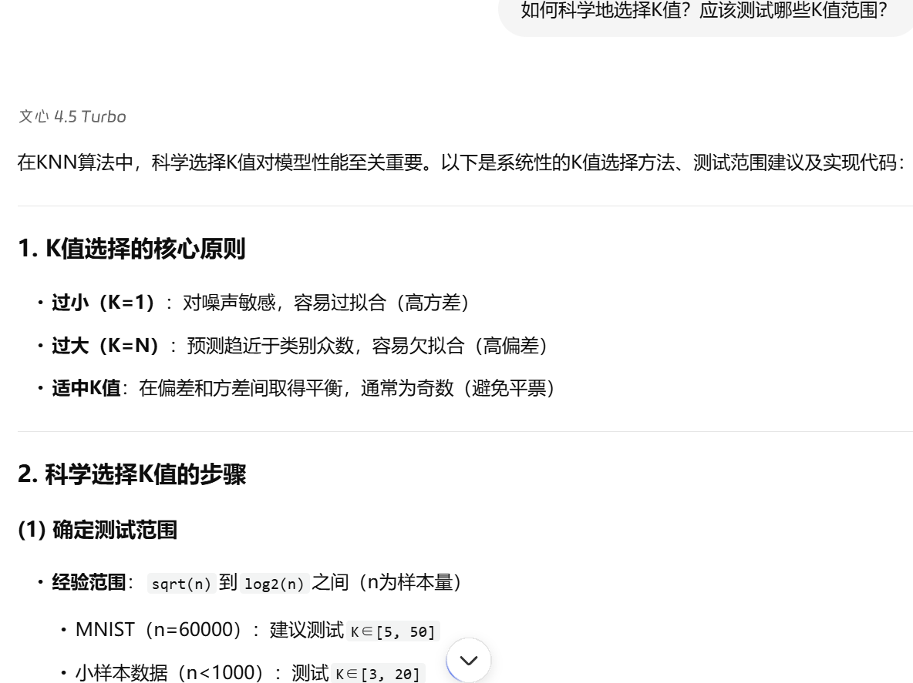
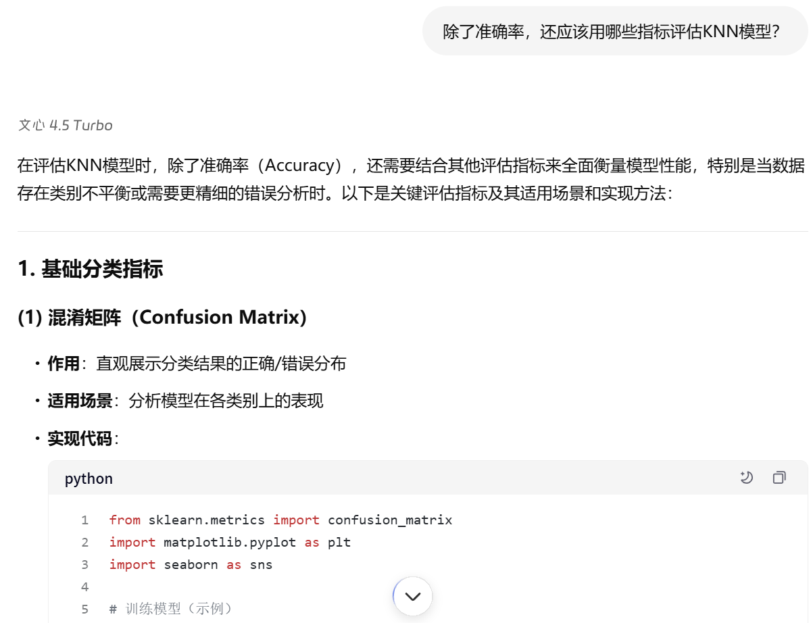
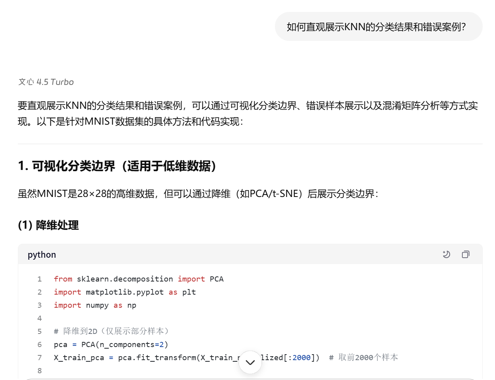
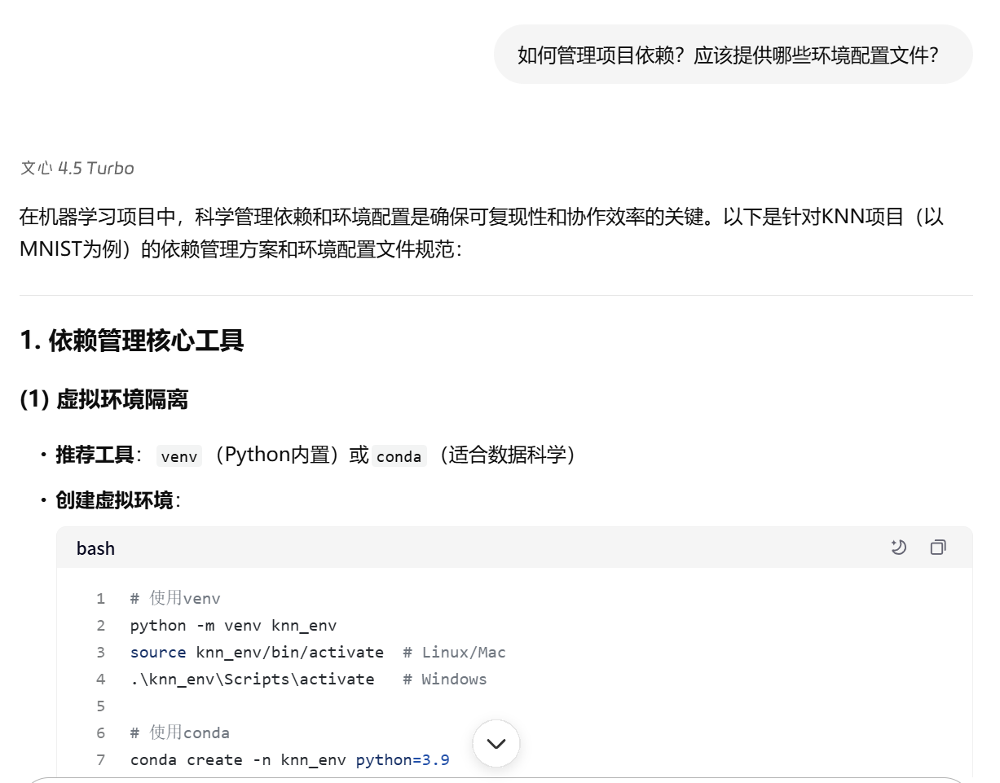

# 协作日志：与 LLM 共创 K-近邻分类器

**项目阶段**：小作业 1 - K-近邻 (K-Nearest Neighbors, K-NN)  
**协作伙伴**：百度文心一言大模型

---

## 第一部分：KNN 原理与实现方法

### 探索点 1：KNN 基本思想与惰性学习

> **我们提出的问题:**  
> &emsp;&emsp;KNN算法为什么被称为"惰性学习"？它的训练和预测阶段分别做什么？

&emsp;&emsp;通过对话，我们理解了KNN在训练阶段仅存储数据，预测阶段才进行距离计算和分类的本质特征。

### 探索点 2：距离度量选择

> **我们提出的问题:**  
> &emsp;&emsp;在图像分类任务中，为什么欧氏距离比曼哈顿距离更适合？

&emsp;&emsp;LLM解释了不同距离度量的适用场景，我们最终选择欧氏距离作为MNIST手写数字分类的距离度量。

### 探索点 3：高维数据处理

> **我们提出的问题:**  
> &emsp;&emsp;784维的MNIST数据是否存在维度灾难？如何缓解？

&emsp;&emsp;我们了解到高维数据中距离计算可能失效的问题，决定先尝试原始像素特征，必要时再考虑降维。

---

## 第二部分：代码实现与优化

### 探索点 4：KNN核心类设计

> **我们提出的问题:**  
> &emsp;&emsp;如何用Python实现一个模块化的KNN分类器类？

&emsp;&emsp;LLM提供了清晰的类结构设计，我们在此基础上实现了fit和predict方法。

### 探索点 5：性能优化方案

> **我们提出的问题:**  
> &emsp;&emsp;如何优化KNN预测速度？能否使用GPU加速？

&emsp;&emsp;我们学习了向量化计算和CuPy GPU加速技术，显著提升了预测效率。

### 探索点 6：数据预处理

> **我们提出的问题:**  
> &emsp;&emsp;MNIST图像数据应该如何预处理？需要归一化吗？

&emsp;&emsp;我们按照建议对图像进行了展平和归一化处理，确保距离计算的合理性。

---

## 第三部分：实验与评估

### 探索点 7：超参数调优

> **我们提出的问题:**  
> &emsp;&emsp;如何科学地选择K值？应该测试哪些K值范围？

&emsp;&emsp;我们采用验证集方法测试了k ∈ {1,3,5,7,9,11,13,15}，最终选择验证集上准确率最高的k值。

### 探索点 8：模型评估指标

> **我们提出的问题:**  
> &emsp;&emsp;除了准确率，还应该用哪些指标评估KNN模型？

&emsp;&emsp;我们决定在准确率基础上增加混淆矩阵可视化，全面分析模型性能。

### 探索点 9：结果可视化

> **我们提出的问题:**  
> &emsp;&emsp;如何直观展示KNN的分类结果和错误案例？

&emsp;&emsp;我们实现了前10个测试样本的可视化，清晰展示预测结果和真实标签。

---

## 第四部分：项目工程化

### 探索点 10：环境配置与依赖管理

> **我们提出的问题:**  
> &emsp;&emsp;如何管理项目依赖？应该提供哪些环境配置文件？

&emsp;&emsp;我们创建了requirements.txt和knn.env.example，确保项目可复现和易部署。

---

**总结**：通过与 LLM 的深入协作，我们不仅成功实现了 K-近邻分类器，更重要的是建立了对惰性学习算法特性的深刻理解，为后续更复杂的机器学习算法学习奠定了坚实基础。