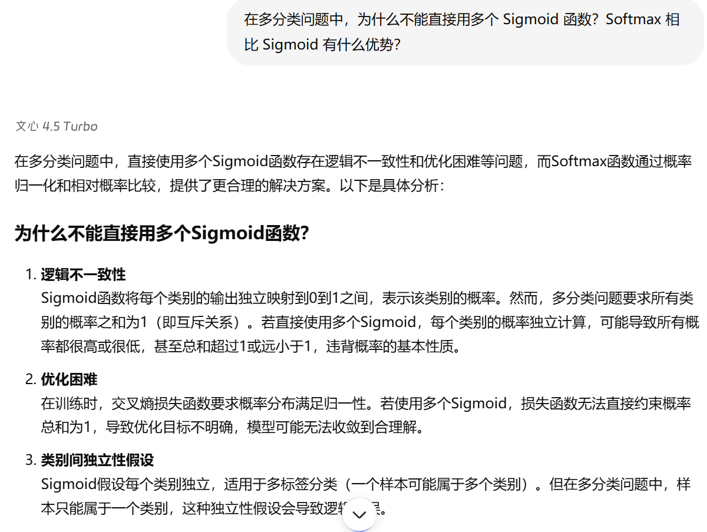
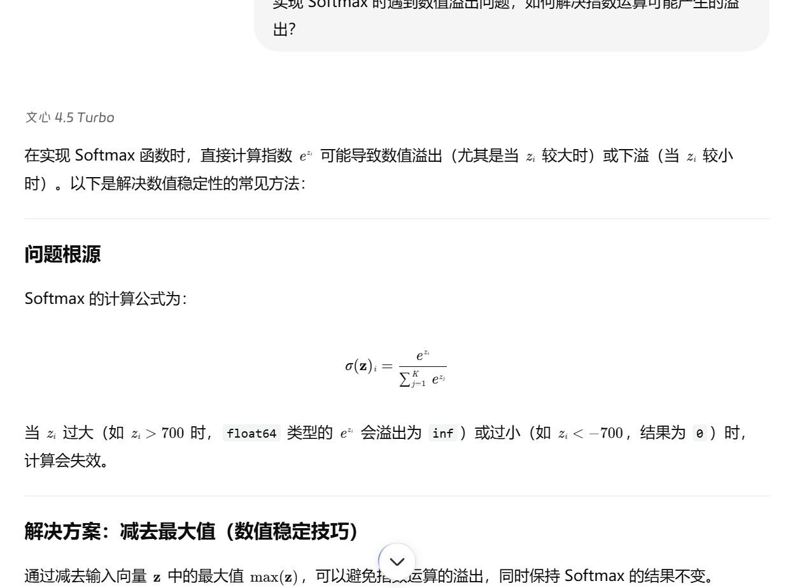
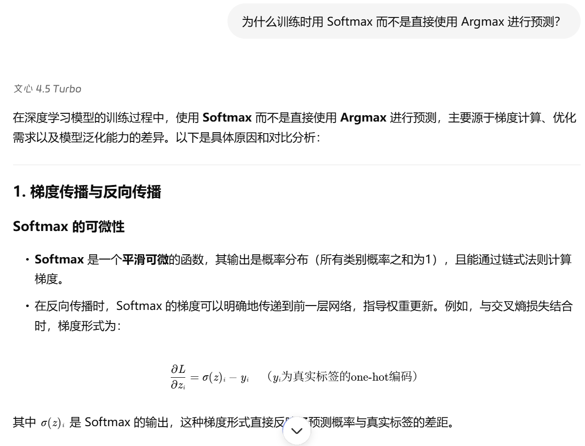
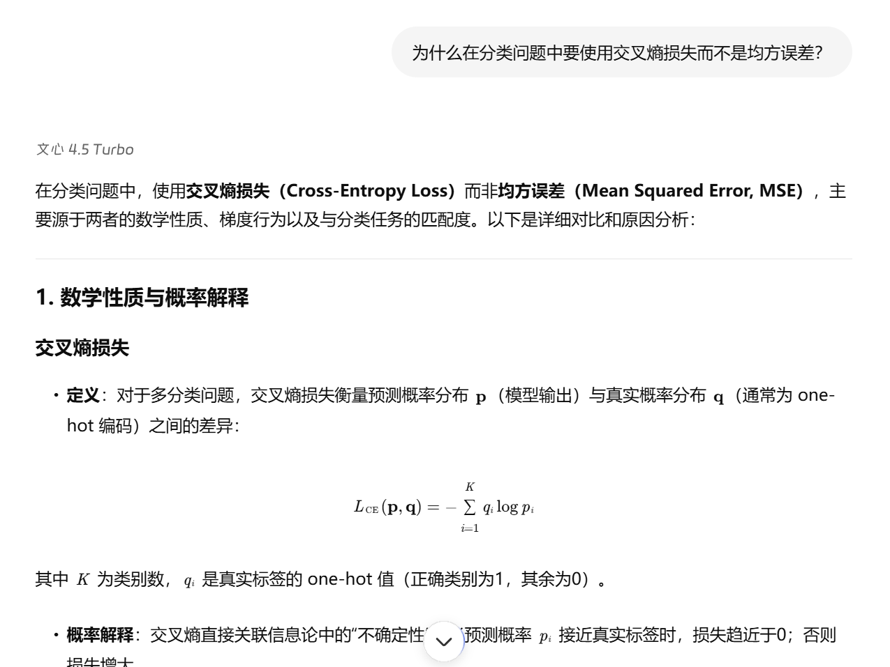
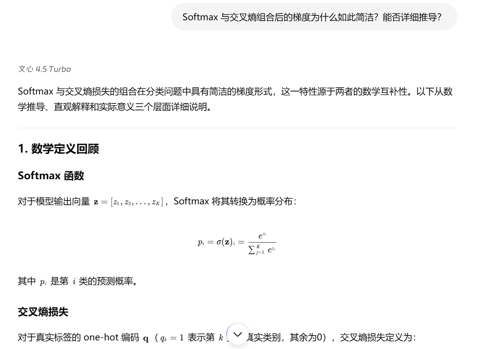
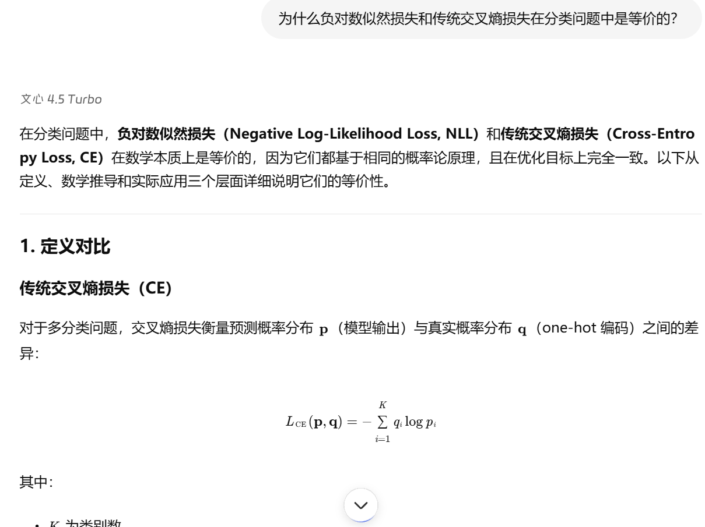
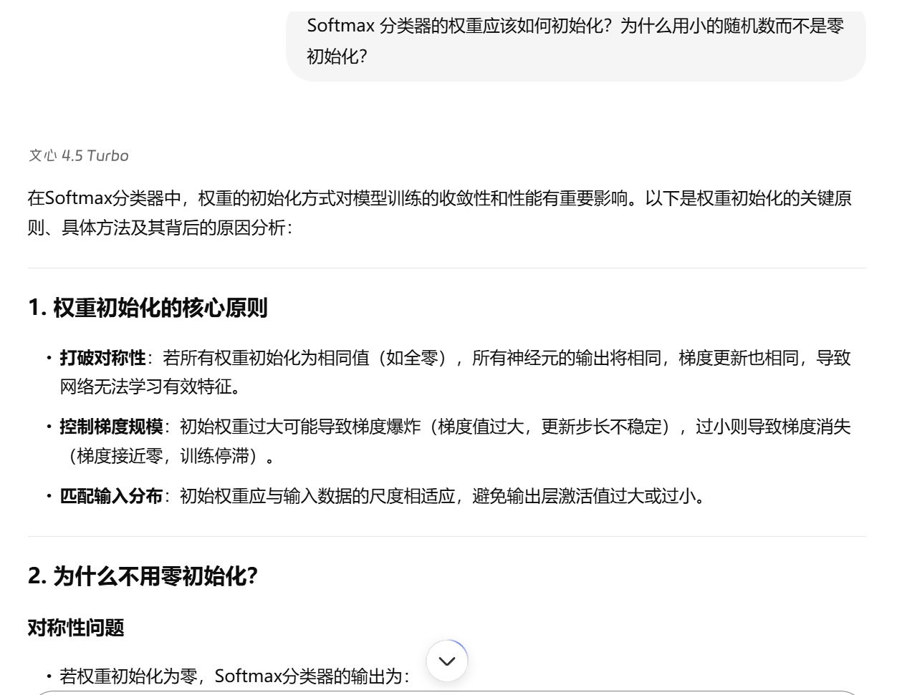
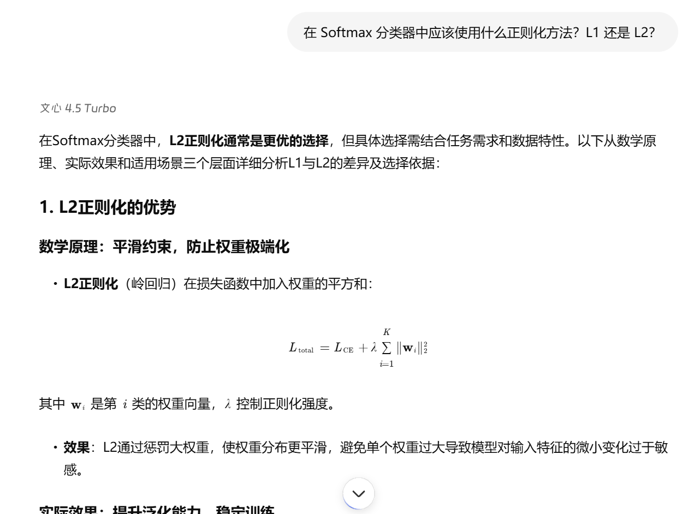
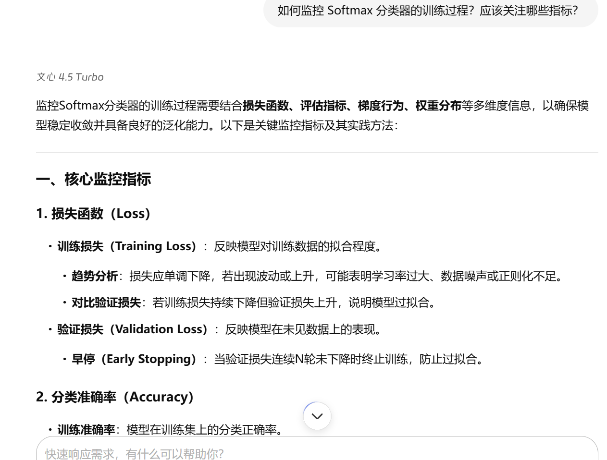

# 协作日志：与 LLM 共创 Softmax 线性分类器

**项目阶段**：小作业 2 - Softmax 线性分类器  
**协作伙伴**：百度文心一言大模型

---

## 第一部分：Softmax 理论基础

### 探索点 1：Softmax 与 Sigmoid 的区别

> **我们提出的问题:**  
> &emsp;&emsp;在多分类问题中，为什么不能直接用多个 Sigmoid 函数？Softmax 相比 Sigmoid 有什么优势？

&emsp;&emsp;通过对话，我们理解了 Sigmoid 在多分类中概率和不等于 1 的问题，而 Softmax 通过归一化确保所有类别概率和为 1，更适合多分类任务。

### 探索点 2：Softmax 数值稳定性问题

> **我们提出的问题:**  
> &emsp;&emsp;实现 Softmax 时遇到数值溢出问题，如何解决指数运算可能产生的溢出？

&emsp;&emsp;LLM 解释了"减去最大值"的数值稳定技巧，我们成功在代码中实现了防止数值溢出的 Softmax 函数。

### 探索点 3：Softmax 与 Argmax 的区别

> **我们提出的问题:**  
> &emsp;&emsp;为什么训练时用 Softmax 而不是直接使用 Argmax 进行预测？

&emsp;&emsp;我们理解了 Argmax 不可导的问题，而 Softmax 提供平滑的概率输出，支持梯度反向传播。

---

## 第二部分：损失函数与梯度推导

### 探索点 4：交叉熵损失的理解

> **我们提出的问题:**  
> &emsp;&emsp;为什么在分类问题中要使用交叉熵损失而不是均方误差？

&emsp;&emsp;LLM 解释了交叉熵损失在分类问题中的理论优势，特别是与概率输出的天然匹配性。

### 探索点 5：Softmax 梯度推导

> **我们提出的问题:**  
> &emsp;&emsp;Softmax 与交叉熵组合后的梯度为什么如此简洁？能否详细推导？

&emsp;&emsp;通过 LLM 的逐步推导，我们理解了最终梯度形式 $\frac{\partial L}{\partial z} = p - y$ 的数学原理。

### 探索点 6：两种交叉熵形式的等价性

> **我们提出的问题:**  
> &emsp;&emsp;为什么负对数似然损失和传统交叉熵损失在分类问题中是等价的？

&emsp;&emsp;我们掌握了在 one-hot 编码下两种损失函数形式的数学等价性，加深了对损失函数的理解。

---

## 第三部分：模型实现与优化

### 探索点 7：全连接层参数初始化

> **我们提出的问题:**  
> &emsp;&emsp;Softmax 分类器的权重应该如何初始化？为什么用小的随机数而不是零初始化？

&emsp;&emsp;我们采用了小随机数初始化策略，避免了对称性破坏问题，确保模型能够正常学习。

### 探索点 8：正则化方法选择

> **我们提出的问题:**  
> &emsp;&emsp;在 Softmax 分类器中应该使用什么正则化方法？L1 还是 L2？

&emsp;&emsp;LLM 建议使用 L2 正则化来防止过拟合，我们在实现中加入了权重衰减项。

### 探索点 9：批量训练策略

> **我们提出的问题:**  
> &emsp;&emsp;如何设计有效的 mini-batch 训练策略？批量大小对训练有什么影响？

&emsp;&emsp;我们实现了批量梯度下降，选择了合适的批量大小来平衡训练速度和稳定性。

---

## 第四部分：实验分析与调试

### 探索点 10：训练过程监控

> **我们提出的问题:**  
> &emsp;&emsp;如何监控 Softmax 分类器的训练过程？应该关注哪些指标？

&emsp;&emsp;我们建立了训练损失和验证准确率的监控体系，确保模型训练的有效性和收敛性。

---

**总结**：通过与 LLM 的深入对话，我们不仅解决了实现过程中的技术难题，更重要的是建立了对 Softmax 分类器理论基础的深刻理解，为后续更复杂的模型实现奠定了坚实基础。